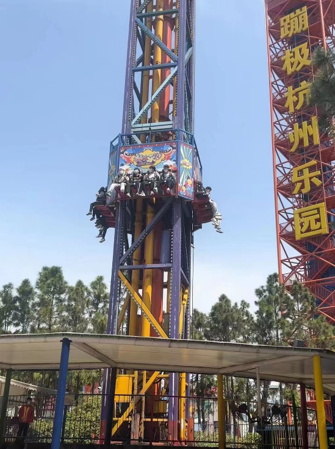
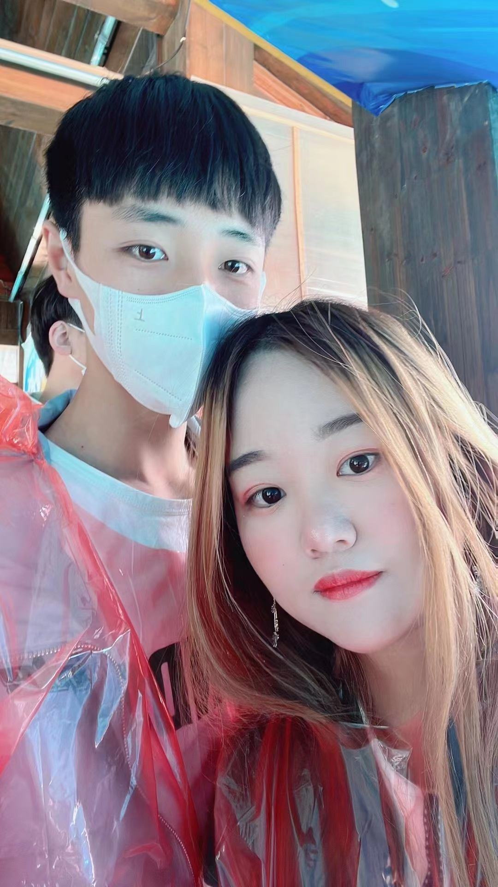
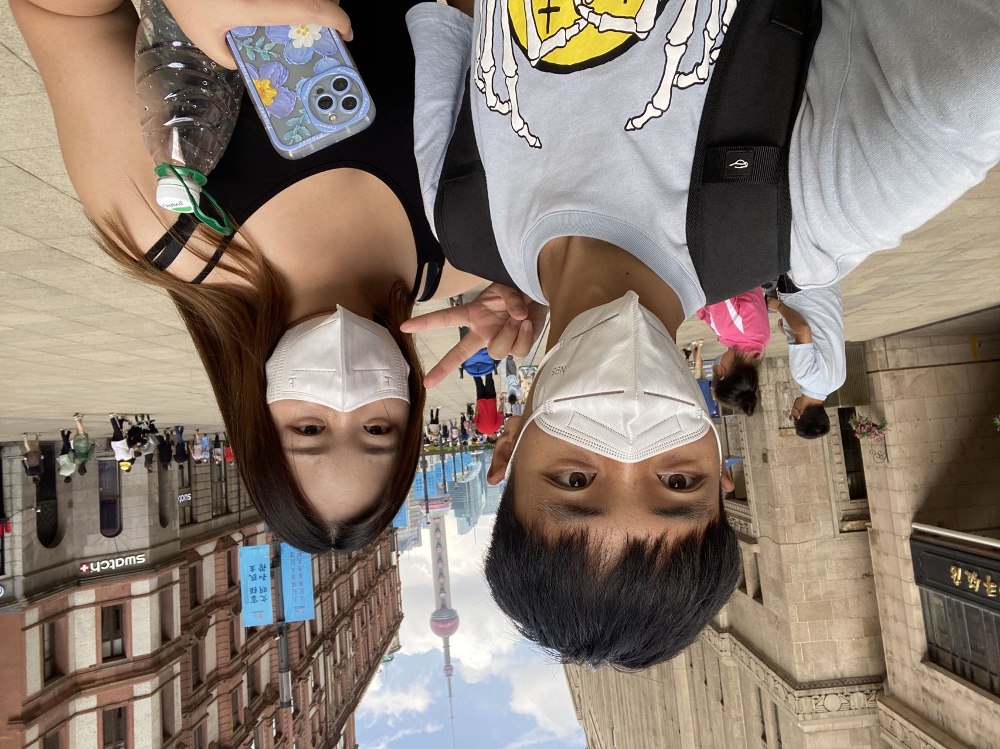
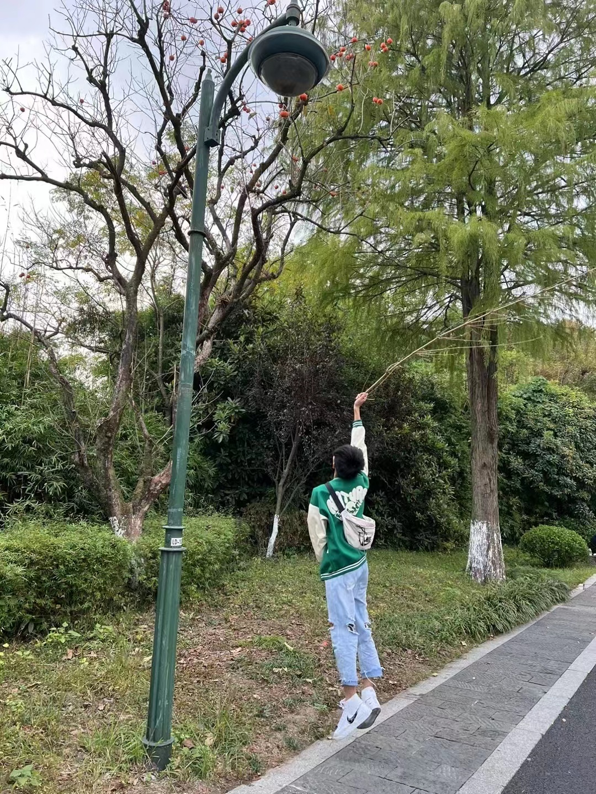
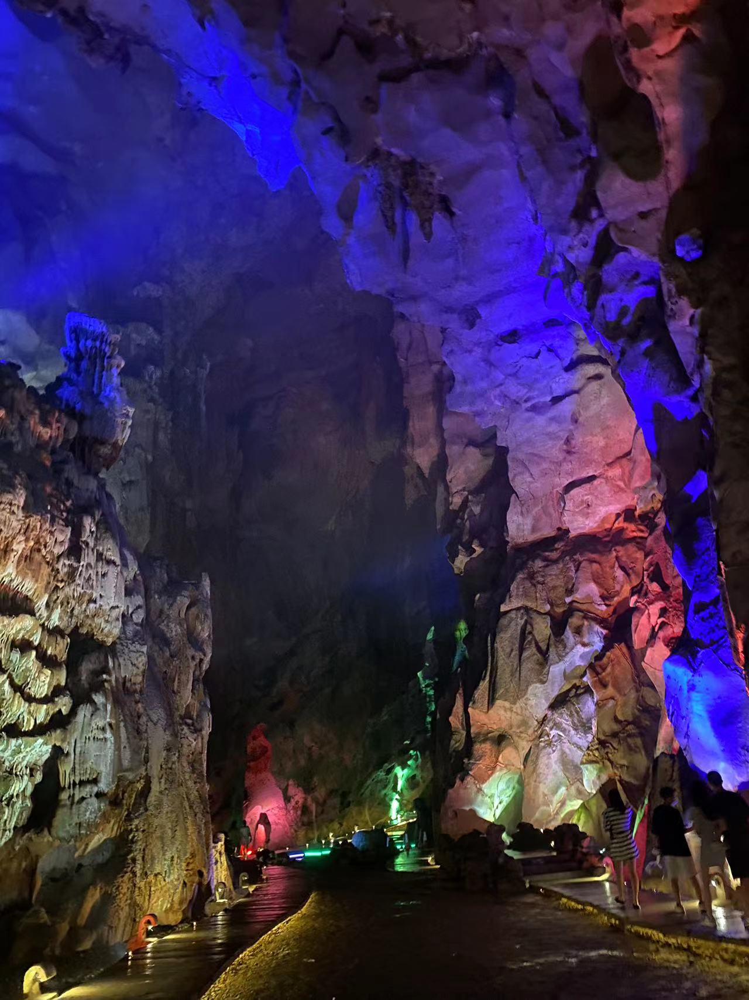
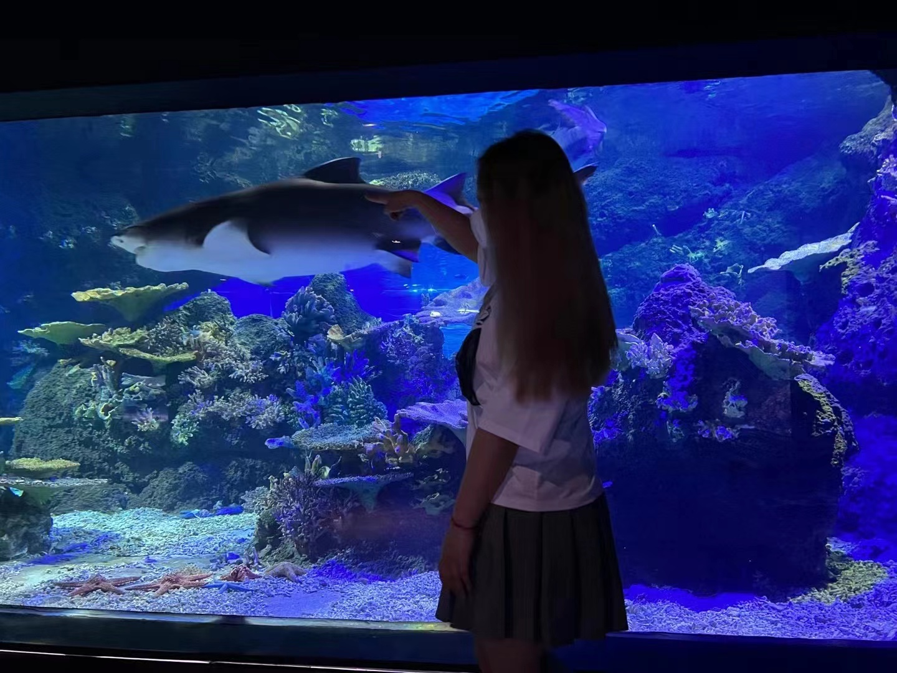
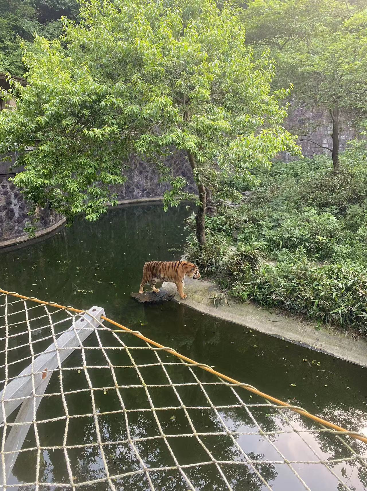
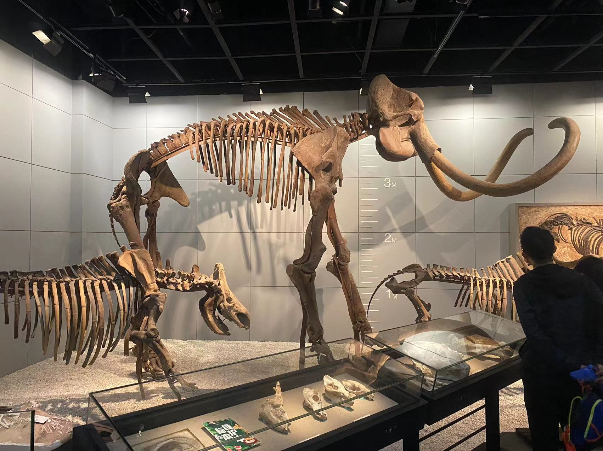
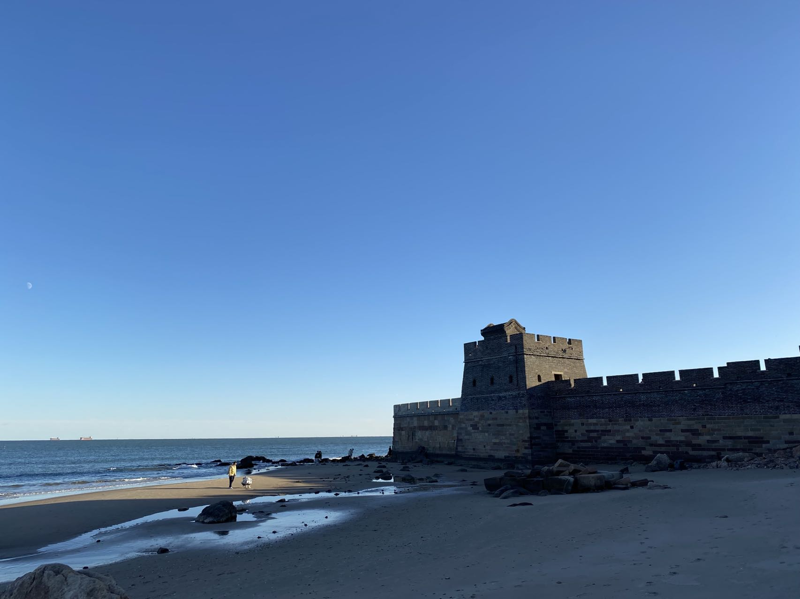

# 田同学 2022 年度总结

## 前言

最近刚刚阳 🐑 完，但是已经开始复工了，这也到年底了，2022 年，这是我在杭州程序员职业生涯的完整的一年时间，就这一年来写篇年度总结，记录分享一下~

## 身体篇

都说身体很重要，所以将身体篇放在第一位，哈哈。😊😊

今年身体非常健康，平时最晚 11 点钟也就睡觉了，周末有时候可能会晚点。

入职体检了一次，没有任何异常。

最近放开了之后，周围身边很多人陆续都开始阳了，在 12-22 的时候，我也是成功阳 🐑 了，在家居家办公了三天，算上周末休息了五天，目前已经恢复了。

## 开源篇

### Fighting Design

我在 `2021` 年的时候，开始接触 vue3，并且为了自学，写了 [tyh-ui2](https://www.github.com/Tyh2001/tyh-ui2) 这个简单的组件库，但是这个库整体都不是很完善，功能很少，代码也不算规范，所以就打算今年开发一套更有体系化的组件库，所以在 `2022-04-24` 这一天，正式开始开发我的全新组件库 [Fighting Design](https://www.github.com/FightingDesign/fighting-design)，到今天，已经开发了 **77** 个常用组件，不过目前还没有发布正式版本，估计要到 2023 年上半年能发布正式版本。

在这一年中呢，fighting design 也是得到了很多人的支持，在 `2022-09-23` 的时候，也就是开发到第 5 个月， 1474 次 commit 的时候，终于的获得了 100 Star ⭐⭐⭐，整整五个月的时间，这也是我唯一一个 star 过百的项目。

在 `2022-09-30` 日的时候，也就是刚过 100 start 之后，由于我在 [阮一峰老师](https://github.com/ruanyf) 的 [周刊](https://github.com/ruanyf/weekly) 仓库中的留言自荐，我的文章 [【开源自荐】Vue3 组件库 Fighting Design](https://github.com/ruanyf/weekly/issues/2651) 被选入了 [科技爱好者周刊（第 225 期）：NPC 演员也是一种职业](https://www.ruanyifeng.com/blog/2022/09/weekly-issue-225.html)。得到了阮一峰老师的推荐，我的组件库也是在近两周内获得了很多 start，也很快就到了 300+ star，感觉很不错。

另外也有很多开源爱好者参与了项目的开发，目前已经有了 [contributors](https://github.com/FightingDesign/fighting-design/graphs/contributors) 41 位。并且将每位开发者都在 [官网](https://fighting.tianyuhao.cn/) 首页展示，也很感谢这些开发者做出的贡献。

除此之外，社区中的一些大佬也是前来支持，如：

- 自由职业前端讲师 [大圣](https://github.com/shengxinjing)
- 技术自媒体作者 [若川](https://github.com/lxchuan12)
- [Varlet](https://github.com/varletjs/varlet) 作者 [耗子君](https://github.com/haoziqaq)
- 全栈讲师 [全栈然叔](https://github.com/su37josephxia)

### Web Components

在 10 月底的时候，偶然开始研究了 [web-components](https://developer.mozilla.org/zh-CN/docs/Web/Web_Components)，并且写了一篇比较挫的文章 [纯原生开发 Web Components 超详细分享](https://juejin.cn/post/7158717654369304612)，当前其实打算是再发布一个 fighting design 的 web components 的版本，但是由于精力和时间有限，就先开始研究了大概两周的时间，后来发现自己根本没时间同时维护这么两个项目，就先搁置了。

在此期间，还接到全栈然叔的邀请，去直播间分享了一波 web components，也顺带推荐了一下自己的 fighting design，直播回放可在 [WebComponent 组件分享-田同学](https://www.bilibili.com/video/BV1zd4y1c7z8/?spm_id_from=333.999.0.0) 观看。

那么针对 web components 我也是创建了一个单独的仓库 [web-components](https://github.com/FightingDesign/web-components)，目前有些搁置，打算等 fighting design 发布正式版稳定之后再来搞一下。

### 其它开源

平时还有一些小的项目也会维护一下，也会有个小几十的 star，下面是我经常维护的一些项目推荐~

| 项目                                                                            | 描述                                                                              | 主页                                                                                           |
| ------------------------------------------------------------------------------- | --------------------------------------------------------------------------------- | ---------------------------------------------------------------------------------------------- |
| <a href="https://github.com/FightingDesign/fighting-design">fighting-design</a> | 🌈 Fighting Design 可在 vue3 应用程序中快速构建交互界面，看起来还不错。           | <a href="https://fighting.tianyuhao.cn">官方文档</a>                                           |
| <a href="https://github.com/Tyh2001/tyh-ui2">tyh-ui2</a>                        | 🌻 一个轻量级组件库，基于 vue3 + typescript，全面拥抱 vue3。                      | <a href="https://v3.tianyuhao.cn/">官方文档</a>                                                |
| <a href="https://github.com/Tyh2001/awesome-books">awesome-books</a>            | 📚 非常棒的程序员学习书籍大全。                                                   | <a href="https://github.com/Tyh2001/awesome-books/blob/master/README.md">README</a>            |
| <a href="https://github.com/ts-mango/ts-mango">ts-mango</a>                     | 🥭 TsMango 是一个用 typescript 编写的实用函数库。                                 | <a href="https://tianyuhao.cn/mango">官方文档</a>                                              |
| <a href="https://github.com/Tyh2001/Interview-record">Interview-record</a>      | 💪 我的面试记录，在这里复盘一下，分享给大家，祝大家都可以拿到心仪的 offer~        | <a href="https://github.com/Tyh2001/Interview-record/blob/master/README.md">README</a>         |
| <a href="https://github.com/Tyh2001/tyh-theme-vscode">tyh-theme-vscode</a>      | 🔥 Tyh-theme 是一个让人视觉舒适的 vscode 主题，内置的黑暗和明亮主题。             | <a href="https://marketplace.visualstudio.com/items?itemName=tyh-theme.tyh-theme">下载地址</a> |
| <a href="https://github.com/Tyh2001/vitepress-template">vitepress-template</a>  | 🍀 Vitepress 模板，开箱即用，快速搭建你的静态网站和博客。                         | <a href="https://github.com/Tyh2001/vitepress-template/blob/master/README.md">README</a>       |
| <a href="https://github.com/Tyh2001/tyh-blog">tyh-blog</a>                      | 🏆 我的博客，记录前端各种领域知识点，以及我的文章和里程碑。                       | <a href="https://blog.tianyuhao.cn/">主页</a>                                                  |
| <a href="https://github.com/Tyh2001/tian-classmate">tian-classmate</a>          | 📃 我的个人简历，同步更新中。                                                     | <a href="https://github.com/Tyh2001/tian-classmate/blob/master/README.md">README</a>           |
| <a href="https://github.com/Tyh2001/Button">Button</a>                          | 🍭 打造你的个性化按钮样式，可自定义样式，自动计算 hover 和 active，一键复制代码。 | <a href="https://tianyuhao.cn/button">主页</a>                                                 |
| <a href="https://github.com/Tyh2001/markdown-emoji">markdown-emoji</a>          | 🤩 可在 Markdown 中使用的 emoji 表情，支持复制原表情和复制表情编码进行使用。      | <a href="https://tianyuhao.cn/emoji">主页</a>                                                  |

### 贡献度

这一年的贡献度还是非常非常足的，一年有近 `6000` 的提交，下面展示一下这一年时间砌的绿墙：

## 工作篇

### 履历

这一年比较特殊，一年的时间跨过了三家公司。

在 `2022-03-23` 的时候，我离职了人生中的第一家公司，下面是第一家公司的工位：

后面休息了四天之后，大概四五天就找到了新的合适的工作，在 `2022-04-11` 入职了人生中的第二家公司。

第二家公司是一个自研公司，入职之后工作做的还都很不错，公司的各种福利待遇也都很好，可入职两个月多之后，全体员工开了场会议，老板在前面讲话。在下班前，讲了很多，其实讲的什么我很多也都听不懂，我完全不知道咋说啥，在开会的同时，我就发现那个之前面试我的前端在看 Boss 直聘。后来开完会之后和同时了解到，说公司资金出现了问题，后面要改变很大的方向，可能要裁员。第二天，部门老大和 hr 就挨个找我们前后端谈话，说明公司的情况，和我们说会改变什么样的策略（也会严重影响到工资方面），问我们可否接受，如果接受就可以留下，不能的话就可以考虑终止劳动合同。第二天我就提出了离职，在 `2022-06-10` 正式离职。第二家公司的工位：

第三份工作是在 `2022-07-14` 入职的，中间休息了一段时间，又去厦门玩了一圈，后面会写。这次是在杭州一家不知名公司做区块链前端开发，负责维护一些自研项目和公司的官网，部门比较特殊，只有我一个前端，可其它部门的前端大佬还是挺多的，下面是现在的工位：

针对今年找工作的面试，我针对每一场面试都做了复盘，放在了 [Interview-record](https://github.com/Tyh2001/Interview-record) 这个仓库中，而且包括简历我也开源在 [tian-classmate](https://github.com/Tyh2001/tian-classmate)。

### 出差

这一年倒是没有出差，唯一的一次本来打算去上海出差，由于是 vue 技术栈的，不精通 react，所以没有去。

倒是去了两次外部。第一次是去支援，写的都是纯业务代码，无限的对接口，无限的表格、表单，真的是好久好久都没写过业务代码了，感觉还是挺痛苦的，就很佩服每天都面对业务代码的小伙伴，恐怕我很难坚持住。。。

第二次是项目有专门的办公地点，需要去驻场办公才行，不过这边还是非常不错的，每天 10 点上班，6 点下班，中午还有免费的午餐，我将全天记录下来可查看 B 站的视频 [2022-12-02 上班的一天](https://www.bilibili.com/video/BV1PA411X78V/?spm_id_from=333.999.0.0)

### 工作内容

工作内容方面，整体还都是比较简单是，并没有太多过于难的方面，基本上都是可以很快就搞定的。下面是工作的提交记录，其实还是蛮少的：

## 旅行篇

旅行篇这应该是我最喜欢的一篇，因为今年是一个丰富多彩的一年，和老婆一起出去玩了好几次，都开心的不行，下面分别来总结下：

### 杭州乐园

时间：2022-04-04

这是我第一次来这比较大型的游乐场，将所有的游乐项目基本上玩了个遍，最后排了三个半小时玩了过山车，过山车真的是：排队三小时，游玩三十秒！

### 厦门

时间：2022-06-22 ~ 2022-06-25

去厦门这就太快乐了，风景非常的好，天很蓝，大海也非常的蓝，我们一起去了：**集美学村、陈嘉庚故居、曾厝垵、双子塔、鼓浪屿、南普陀寺、厦门大学、厦门植物园、中山路步行街**

### 南京

时间：2022-07-30 ~ 2022-07-31

旅行的第二站——南京，在这个长满梧桐树的城市，我们一起去了：**总统府、夫子庙、美龄宫、明孝陵、中山陵、古鸡鸣寺、秦淮河**

### 上海

时间：2022-09-10 ~ 2022-09-11

正好是中秋节的时候，旅行第三站——上海。我们一起去了：**外滩、四行仓库**

### 绍兴酷玩王国游乐场

这是今年去的第二场游乐场，这次的游乐场人还算少，我游乐场杀手将所有的项目全部玩了一遍，有些项目玩了两遍甚至三遍。

下面大摆锤上有我：

### 其它

除此之外，还去了杭州的一些景点，其实今年玩的还真不少

- 宝石山
- 江和美海洋公园
- 西溪湿地公园
- 临平公园
- 埃菲尔铁塔广场
- 超山
- 杭州动物园
- 704 工程
- 六和塔公园
- 杭州植物园
- 宝寿山
- 灵山环境
- 三泉印月
- 午潮山
- 北高峰
- 奥体中心

## 学习篇

针对学习方面，其实主要也就是 vue3 和 TypeScript，还是以基础为主。这两个其实在平时开发组件库的时候就可以学习到很多东西，平时通过看一些其它组件库的源码，也可以学习到很多东西。

最近通过短视频平台也找到了不少比较优秀的讲师，今年我感觉最好的一个课程就是渡一袁进老师的大师课，不过现在已经下架了，我将比较重要的 [事件循环](https://blog.tianyuhao.cn/docs/javascript/event-loop.html) 做了记录放在了这里。

另外也看书看了《JavaScript 设计模式与开发实践》整体还是不错的。

还有 《Vue.js 设计与实现》只是看了一半，后面也有点吃力。

其实主要的学习还都是平时做开源的时候，通过阅读其它项目的源码可以很快的学习到一些新的东西。

## 社群篇

这一年中，微信加了 300 多人，全部都是和开发、开源相关的人，除了交流一些技术或者解决一些问题外，平时也都从来不说话。有些也就是通过的时候说几句话，之后再也没说过话的。

基本上都是每天和老婆在一起，虽然微信的还有有几百，但大多数都是和工作相关的，我们两个的圈子真的挺窄的。

## 娱乐篇

### 打游戏

今年下半年开始，又开始玩了玩曾经玩过的游戏，有很多的经典大作还真是回味无穷，但是有些就感觉是越来越挫。

DNF 的话，无限爆肝刷图，已经没那么多时间去搞了，只是大号一套希洛克毕业装备就再也没提升了。

英雄联盟的话，感觉和之前的已经完全不是一个游戏了，总感觉哪里不舒服，而且游戏环境也比较差，本子太多，现在玩的很少。

绝地求生，emmmmm，感觉已经凉凉的，匹配的队友都是机器人，没人连麦，曾经都是满图都是真人，现在基本上都是机器人互殴，而且外挂满天飞，越更新约挫，节奏越来越快，毫无游戏体验。

所以现在开始转向了单机游戏，这就很快乐了，将《古墓丽影：崛起》《死亡搁浅》都从头到尾玩了一遍，有时候还会玩玩《消逝的光芒》，接下来打算继续玩《刺客信条：奥德赛》

下面是一些游戏截图：

### 世界杯

今年的世界杯，是我人生中看的第一场世界杯，而且我只是看了总决赛，因为在世界杯开始的时候，就期盼着梅西能冲到决赛，没想到最后真的冲到决赛拿到冠军。

我之前从来没看过足球，这次被老婆带着一起看球，完整的看了一场比赛，把足球的玩法和规则也懂了不少。

后面为了庆祝阿根廷夺冠，特意买了他们在领奖台上的照片做纪念：

## 回家篇

这一年只回家了一次，是在十一的时候，在家待了七天，不过居家隔离了三天，后面四天很快就过去了。

去了海边，下地干了点活：

## 总结

第一次写年度总结，感觉今年整体还是很不错的，各个地方都很棒，希望新的一年越来越好。

2023 祝各位奋斗晋升，喜欢摸鱼的都自由～
