# 田同学 2023 年度总结

## 前言

时间可真是太快了，感觉写完 [田同学 2022 年度总结](https://juejin.cn/post/7183301086524997688) 就在前几天的感觉，2023 是我在杭州程序员职业生涯第二年的时间，今年真的是还挺跌宕起伏的，哈哈。和去年一样，就这一年来写篇年度总结，记录分享一下~

## 年后

年后回来，1 月 28 日开始上班，2 月份还是和往常一样工作。3 月 1 号的时候，早上刚到，在工位上吃着早餐，当时吃了一个包子和一个玉米：

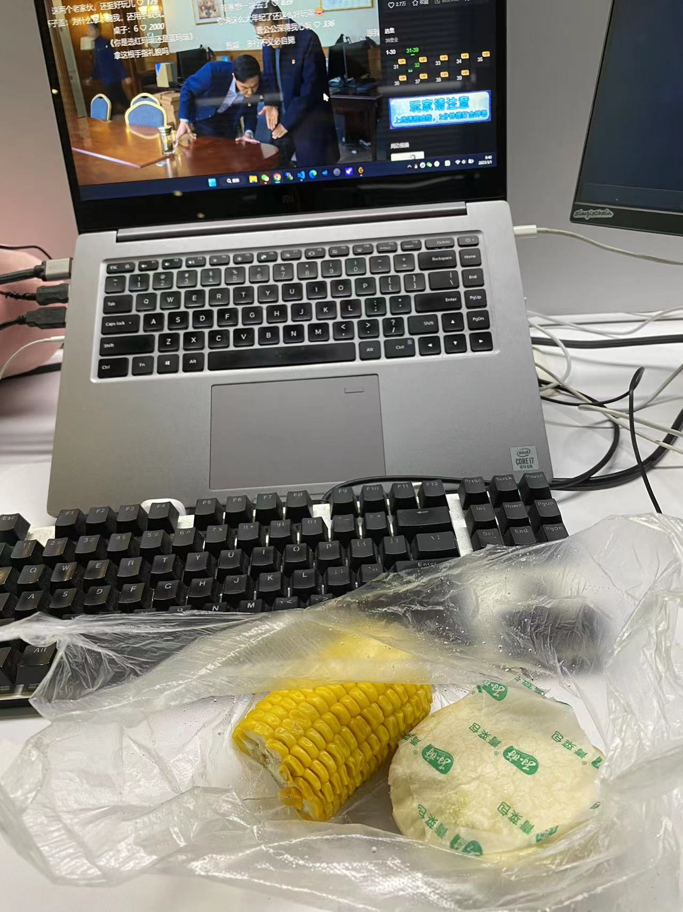

还没吃完，hr 叫我去会议室开会，当时我也不知道啥事，聊了很久，简单一句话聊的内容：现在部门每个人都在挨个的谈话，部门可能要解散拆分。

让我明天就可以不用上班了，只要每天打个卡就可以了，其余时间我干啥去都可以，一直到 4 月底，并且让我可以开始找新的工作了。

聊完天回来之后，我就去楼下，给老婆打了电话，说了刚才的事情，她说让我正好可以先休息一下，不用着急找工作，哈哈。

当天下午，也就没啥事情了，就随便整理整理代码、娱乐一下。

往后的一个月里面，就是每天早上去打个卡，白天的时间也就自由了，偶尔投投简历，写写自己的项目。本来也没着急，也就打算随缘找找，随便投投简历，找工作应该也没有那么难，4 月 1 日算是正式离职，本以为顶多四月底，也能找的工作了，可没成想，这一找，就找了**五个月**的工作。

## 离职期间

离职的前一个月，每天投投简历，不过基本上也都沉入大海了，投出去的也没有回复，白天就在家里打英雄联盟，下午做个饭，正好老婆下班了回来吃饭。

一个月过后，也正式离职了，游戏也不想再打了，就打算着自己能做点什么，尝试自己每天不用上班对着电脑也可以赚到钱，当时正值 AI 发展最火热的时候，就每天早上早早起床，背着书包带着电脑，早上九点钟左右到[星巴克](https://www.starbucks.com.cn/)研究一些 AI 相关的东西，再学习一些新的内容。每天在星巴克除去中午出去吃个饭是时间，一直都在对着电脑。到了下午三四点钟，就去楼上超市买个菜，回家做饭。

除了每天学习的时间外，离职期间还去了好几个城市去旅行，都去了：海口、三亚、黄山、大连、山海关、秦皇岛、天津、北京。具体玩的细节后面会分别描述。

下面是 4 月 23 日星巴克地球日喝的免费咖啡：

## 投递情况

投递简历起初是使用 BOSS 直聘，后来也用了 脉脉、智联等软件，但是除了 BOSS 之外，其它的软件感觉真都不怎么样。BOSS 一天大概可以投递 180 多个简历，起初还是有选择性的投递，看看那些公司比较合适，但是这样就导致基本上没有人回复，很多时候一天投递到上限，回复的也就一两个，更别说面试了，在一个半月的时间里，我没有约到过面试。

所以后来也就随缘了，每天海投，直接从第一个开始投，一直投到上限，还注册了小号投递，一直到 8 月份找到工作，我一共投递出去了 **6000+** 简历。

其中，投递了好几种岗位，运营、销售、开发、快递员、货运司机、网约车、检票员、主播，都有面试过。去了各行各业面试，也让我感受到了和互联网相比，不一样的面试形式。比如我有面试过送货的骑手，面试的流程呢，就是上来让你填个表，然后等待面试，面试是一个面试官对两个人，进去坐下之后，面试官直接拿一根笔，在纸上边说边画，送 1 单多少钱，一天送多少单，然后如何打款，电动车如何租赁，介绍完之后，就问：明天能不能来上班？我当时说再考虑下，看我们两个都没啥问题，就说面试结束了，需要入职再点电话联系。

面试结束之后，我就很是震惊，居然这样传统行业面试居然这么草率，不像是开发面试卷的都那么厉害，这样的面试我还真有点不太习惯。

主播的话，虽然我之前做过，也可以做，但是玩的游戏内容真的是无聊透顶，很多游戏的玩法，我之前也没加过。竞技类型的游戏也不适合我了。

销售的话，我投递了特斯拉的销售，但是好像都需要经验才行，hr 只是给打过一次电话，就再也没有音讯了。

下面是投递特斯拉的情况：

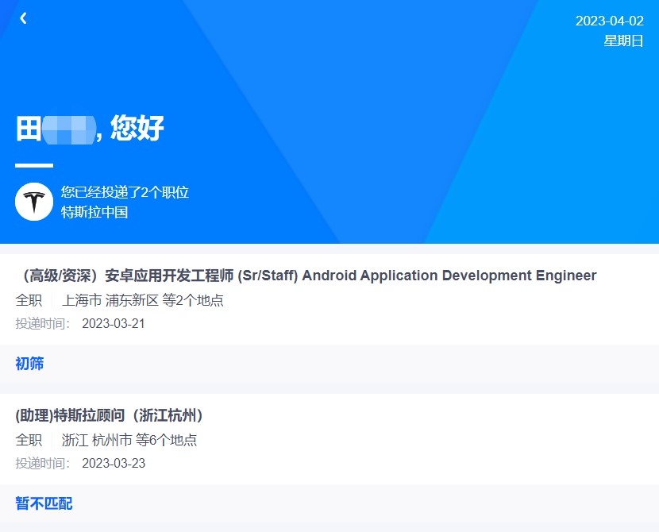

## 短视频

这个短视频的时代，有很多人通过短视频翻身，而且没有入门的门槛，所以我也打算开始尝试第一个副业：做短视频。其实我期望的副业就是可以 0 成本入手尝试，不要花一分钱，这样我就可以无限的试错。就算我没有成功，我也不会有任何损失，给我带来的只有收获，哪怕是失败。

其实我的想法是，我只要每天对着电脑，不需要有摄影师，不需要表演，就可以做出来视频，当时也是通过社交网络看到一个和 AI 融合，就可以做出短视频的方法，自己也开始研究。

当时就使用 ChatGPT 来写一些主题的文案，然后使用一个剪辑工具可以将文案生成视频，再使用一些绘画的 AI 工具画出视频主题的封面图，所有的声音也通过 AI 来合成。那时候的 AI 工具真的是五花八门，有收费的也有免费的，质量也是参差不齐，为了节约成本，我只能是找到一些质量较高的免费工具。

起初是使用剪映，将文案喂给剪辑软件，然后就会生成一个有图有声音有字幕的视频。第一个我做的是讲故事主题的号，并且发布到抖音。以我对抖音的理解：只要是一个新号，当发布了 10 个作品之后，播放量依然惨不忍睹的情况下，这个号也就没必要做下去了。然而我的号就被我做成了这样。

第一个主题失败了，后面我又打算做一个旅行相关的，找到一个城市或者景点，让 AI 写个介绍，然后生成视频，并且我尝试在视频中加入一些彩蛋，抖音和快手两个平台同时发布视频。而且还打算做一个旅行主题相关的小程序和官网，通过短视频平台的流量，推广小程序，在小程序中加入付费相关的内容，来实现收入。为了实现这一想法，还特意买了个新的域名，域名就是我这个项目的名字。AI 的视频生成工具我也找到了个质量更高一些的[度加](https://aigc.baidu.com/make)，做了一段时间之后，大概发布了 20 多个视频之后，也是惨不忍睹，也是不再更新了。

短视频这条路，运气成分太高了，看似入门门槛很低，但是早就饱和的都要溢出来了。

## 做个自己的产品

看来短视频这条路不太容易走通，并且运气成分太大。还是打算把自己开发者的知识运用一下吧。之前打算做个旅行相关的网站。正好之前有接触过一个 node 的后端框架 [nestjs](https://github.com/nestjs/nest)，并且 Mysql 也会一点，就开始配合 AI 来做个自己的产品，不会的东西使用 AI 来帮助实现。前端的话，就使用 vue3，组件库就用我自己的组件库 [fighting-design](https://github.com/FightingDesign/fighting-design)。在开发的途中，也会发现一些组件库的 bug，正好也可以修复掉其中的一些问题。两个项目一起完善。

我希望自己的网站是足够有特点的，也就是用户能看到的东西、交互上要实现和市面上的产品不一样，或许每个打算做自己产品的人都是这样想的，但是如何做？做成什么样？这是最让人头疼的，所以我就会经常看各式各样的网站，发现都不是我想要的效果，在每天睡前，或者坐地铁或坐车的时候，就一直在思考，什么样的交互才最有特色的。

其实有一些特殊的想法，不一定是要在相似的产品中找到答案。比如我想要做一个网站，不一定是在众多网站中找到灵感。也可以通过其它途径。比如我比较喜欢的 [北京冬奥会开幕式倒计时短片](https://www.bilibili.com/video/BV1Vr4y1z7Up/?spm_id_from=333.999.0.0&vd_source=45b9ebc52408dcecd5ef3a71d406552e)，冬奥会的开场倒计时，我感觉就是一个打破常规的操作：倒计时间隔不一定是 1 秒钟。使用二十四个节气，作为倒计时，依次播放，正好冬奥会是在立春，所以倒计时最后定格在了立春。除此之外，我参考的还有：杭州亚运会的开幕式、一些海报、特斯拉等。

最终，我借助了特斯拉的设计，想到了一个全新的创意，因为特斯拉的各种操作设计都是比较颠覆常规的，可以说是有些反人类，因为我想要做出来的效果就是：反人类设计，大脑洞的设计。所以，参考一些和你当前做的看似无关的东西，只要深入思考一下，想到一些类似的设计手法，获取可以得到不同寻常的结果，这个结果要么很糟糕，要么很亮眼，起码我不会让人说：“还行” 这种中等不上不下的词。我希望的是：要么最好，要么最差。我的作品在后来面试的时候，也惊艳到了面试官，为我拿到了 offer。

目前我的产品，还没有开源，所以我具体做了那些反人类的设计，目前也没有展示给更多的人。

后来我又开发了微信小程序版本，将 web 端的设计，换了一种可以在手机上交互的全新的形式来展现的。目前还在开发中，还未上线，近期也在一直完善中，希望 2024 年可以面向大家展示一下，哈哈。

## 找到工作

找了五个月的工作，我终于在 7 月 28 日的时候，拿到了 offer。面试的时候，我向面试官介绍了我在做的产品，介绍了我的主题、前端、后端等，还聊了一些我具体的功能实现方式。

工作的内容主要是原生的微信小程序，微信小程序和 vue2 的语法很相似，所以虽然我之前没怎么写过小程序，所以上手也是比较快的，开始工作的两个月，我基本上脱离的 web 端。

快到年底，工作的内容还是比较充实的。目前我主要负责两个微信小程序和一个 vue3 的后台管理系统。

在工作中，有个特殊的工作内容就是：招聘面试。其实我一直是非常喜欢面试的，或者说非常享受面试，因为面试官，大多数都是这个行业中算是一个经验丰富的角色，面试过程中可以和大佬一对一聊天，做一些技术交流，聊一聊我的想法，看看面试官是如何看待的，相互交换一下意见，我感觉对我的收获是非常大的，并且也可以给我指出一些不足，因为我每次面试，我都会问面试官一个非常重要的问题：**您感觉我还有什么需要提升的吗**？我只要问出了这个问题，面试官回答了我之后，哪怕这次面试我没有通过，对我来说也是非常值得的。所以在之前我也非常期待自己也可以坐在面试官的位置上换个角度学习也许有不一样的收获。具体面试相关的细节在后文会详细描述。

下面放一张工位的照片：

无论是工作中，还是上半年离职期间，我认为我的时间都是非常充实的，每天都很开心，学和玩，基本上啥也没耽误，下面分别来介绍一下。

## 学-根本学不完

### 开源项目得到了赞助

我在 [fighting-design](https://github.com/FightingDesign/fighting-design) 的仓库和官网上放了我的支付宝和微信的收款二维码，希望可以得到一些赞助。没想到的是，在 2 月 18 日的时候，收到了社区同学的 **200 元**赞助。其实对于开源赞助来说，200 已经算是巨款了。

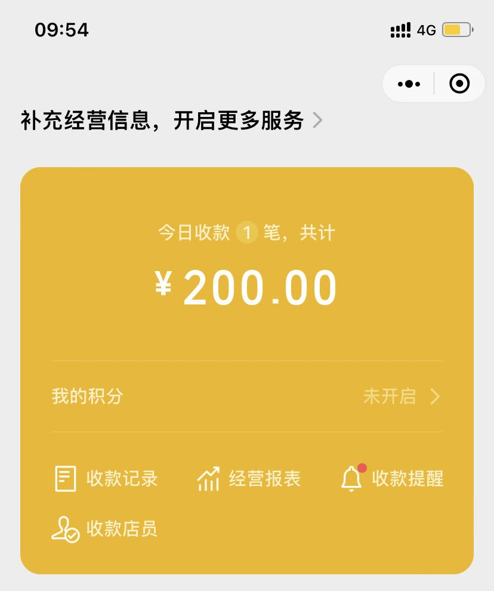

### 后端和操作系统

4 月份的时候，自己学了个后端框架 [nestjs](https://github.com/nestjs/nest)，是一个基于 Node 的 MVC 框架，支持 TypeScript。现在觉得，选择学习 nest 真的是个非常正确的决定！

为什么呢？首先，身为前端工程师对 js 零成本上手，可以自己来实现一个全栈的项目，当然这还不是最主要的。更重要的是，在国外的生态中，nest 还是非常受欢迎的，不像是在国内，基本上任何一个后端都要选择 Java，首先体积太过于庞大了，而且人力成本很高。国外 node 相关的框架还是很受欢迎的，对于前端工程师一个人也可以实现一个完整的项目，有机会可以接到一些海外的兼职，非常不错。

后端有个必须要打交道的就是数据库，开始我使用的是 [Navicat](https://www.navicat.com/en/) 和 [宝塔](https://www.bt.cn/new/index.html)，图形化的数据库，后来感觉，老是使用图形化的界面，收获还是太小了，还是得自己学学 SQL，就放弃了图形化工具的使用。开始学习自己手写 SQL 和命令，不会的就使用 ChatGPT 学习一下，再把学到的 SQL 和命令记录成 [文档](https://blog.tianyuhao.cn/docs/server/server-2.html)。

另外的话就是操作系统，现在每天我使用三个操作系统，公司的电脑是 MacOS，我的笔记本是 Windows，我的服务器是 Linux，也正好将三个主流的操作系统全部了解一下。

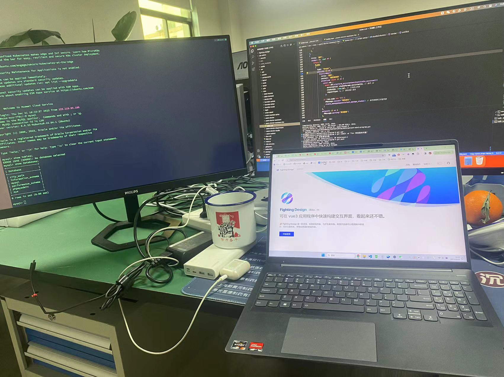

### React

作为前端最主流的框架之一，React 之前一直没有接触，最近我也开始学习，为什么呢？因为 React 可以帮我赚到钱。只能说，现在什么东西可以帮我赚到钱，我就学什么，海外的很多岗位都是需要 React，后端大多数就是前面说的 nestjs，所以会了这两个技能，对于找到一些海外的工作机会机更多一些。也是最近才开始学的，并且把学习的内容也记录成为了[文档](https://blog.tianyuhao.cn/docs/react/react-1.html)。

React 相比于 vue 的区别呢。vue 是会给你定制很多规范，你必须按照它的规则来写，所以就会导致大家写的 vue 代码基本上都一样，大差不差。react 的话，就是完全给你自由，各个你要用的东西都需要你自己去配置，它内部的方法和 API 也非常少，配置完全开放。所以新手更适合 vue，但是会了 vue 之后，上手 react 很容易，一些方法看看就知道咋用了。

React 基础学完之后，目前在开始学学它的周边生态，比如 [react-router](https://reactrouter.com/en/main) 和 [zustand](https://github.com/pmndrs/zustand)，其它的就是一些 css 相关的处理方法。学起来还是比较愉快的。

### 看书

《埃隆·马斯克传》

今年看了一本新书《埃隆·马斯克传》。第一次读传记，讲的是马斯克从出生，到 2023 年发生的所有的事情，从他开始创业，到后来如何赚到第一笔钱，后来又创立了 SpaceX 和特斯拉的一系列大事件。再到 2023 年收购 twitter 改名为 [𝕏](https://x.com) 的过程。即将看完了，还差一点。一天看书的时间比较少，所以进度会比较慢，一天大概就看一章左右，99%的看书时间都是在地铁上，因为我每天在地铁上的时间比价长，没座位的时候就看看书，有座位了就打开电脑，利用好每一分钟的时间，就好像 [requestIdleCallback](https://developer.mozilla.org/zh-CN/docs/Web/API/Window/requestIdleCallback) 一样，压满空闲时间，哈哈。

《法律的悖论》

另外 12 月 30 日刷短视频时候买了本新书《法律的悖论》，看推荐还不错，是[罗翔](https://baike.baidu.com/link?url=twBvzMeq-q7jhndaAkR2LnOfKwhLw32nawJz0bZJoezhlHqbkzm5XibkMmaBC2cbKIc_22-dvHTDwFuhdlfnrfGuNUKIYvFiTD42zZr17Ae)老师的新书，也买了回来，还没开始看，打算作为 2024 年的第一本书看。

### 新闻联播

今年下半年，我开始坚持看[新闻联播](https://tv.cctv.com/lm/xwlb/index.shtml)，每天早上在地铁上，或者晚上吃完饭，我都会看看录播，了解到一些最前沿的新闻。

### 最近

最近一段时间，将新的服务器都配置好的，自己的微信小程序也部署好了，可以正常运行了。把 MacOS、Linux、Windows 三个操作系统都配置了一遍后端环境，包括 Redis、Mysql 和前端内容，在三个操作系统中我都可以正常开发自己的产品了，而且所有环境配置都是一致的。

其它的时间会学一学 React，写写年度总结等等。

### 2024 计划学习内容

- 学习更多操作系统相关内容，对 MacOS、Linux、Windows 系统更加了解，命令行工具更熟练
- 计划在电脑上装一个 Linux 的图形化的操作系统，了解一下使用方式
- 浅学一下 [Swift](https://github.com/apple/swift)，可以的话自己研究一下苹果 App 上架流程
- 对 Mysql 更加熟练，可以手写 SQL
- 对服务器配置更了解
- React 再多学学，用 React 写一个完整的前端项目
- 学习 [PowerShell](https://github.com/PowerShell/PowerShell)

在 2024 年年度总结中，会对上面学习内容做个总结。

## 玩-必须得玩儿好

玩，是我每年分享中最喜欢的一个部分

### 绍兴

年后回来的时候，去了鲁迅老家绍兴，看了看鲁迅曾经待过的地方，我和老婆一起去了鲁迅故居、百草园、三味书屋、墨池。从小就学了很多鲁迅先生的课文，其中我最新喜欢的就是《少年闰土》。

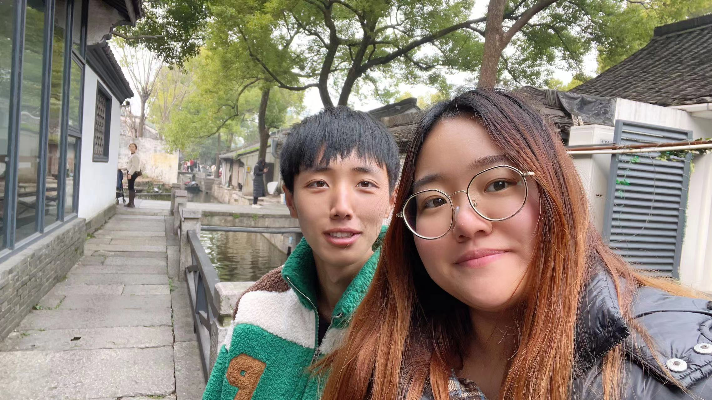

### 三次上海

今年去了三次上海。

第一次是 3 月 29 日。因为老婆去上海出差，就去了上海计划去看个服装展。但是我到了比较晚，没有来得及去看。白天只是在陆家嘴附件绕了一圈。顺道在陆家嘴试驾了一波[蔚来 ET5](https://www.nio.cn/et5)汽车。然后去了上海中心大厦 52 层的朵云书院参观了一下。晚上去了特斯拉店里看了看车。

第二次 4 月 21 日。去上海玩了一圈，一天时间，一直在奔跑，打算一天时间可以去更多的地方。一天我去了：上海博物馆、上海世博馆、四行仓库、上海元代水闸博物馆、鲁迅纪念馆、陆家嘴。到了陆家嘴之后就随便逛了逛，没有再去其它地方了，后面又找了个商场，去看了看车，分别看了特斯拉和[极越](https://www.jiyue-auto.com/)，销售给我介绍了一个多小时，虽然车我不咋喜欢，不过在交流过程中也是有收获的。

第三次是 6 月 1 日。没错，在儿童节当天我去了上海，但是不是为了去过儿童节，哈哈。当时在 [𝕏](https://x.com) 上看到了这样一篇推文：[马斯克预计本周访问中国并会见官员](https://twitter.com/Reuters/status/1663171089202028545)，后面短视频平台就开始实时推送马斯克来中国的消息。开始到了北京，后面还说要来上海特斯拉超级工厂。当天马斯克已经到了上海，我就打算去上海特斯拉超级工厂看看能不能见到马斯克。其实前一天晚上我就想去，但是比较犹豫，早上起来看短视频又播报了昨晚马斯克在工厂内和员工的合照，我就下定了决心打算去试试。

虽然我知道我有 **99.9%** 的几率见不到马斯克，但是我还是打算为那一丝的可能争取一下。因为不管能否成功，我都尝试一下，有机会我都要把握一下，我努力过了，可能我会失败，但是起码我不会后悔了。当时早上九点多，我就立刻买了到上海虹桥的高铁。到了虹桥之后，还要再坐四个小时的地铁和公交。直到下午两点半，我才到了上海浦东新区特斯拉超级工厂的门口，看到了和视频中一样的工厂，工厂上有个巨大的 logo，和 TESLA 字母。之后，我通过短视频得知马斯克已经从上海离开了，乘坐私人飞机飞回美国了。当时我只是和门口的保安交流了几句，保安说是昨晚半夜马斯克才来的，很早就走了。我只能在工厂前拍了几张照片，就又乘坐四个小时的公交和地铁回到了虹桥，在虹桥坐高铁回了杭州。到家已经晚上 10 点了。一天有 10 个小时的时间都在赶路，真是个难忘的儿童节。当天我发了这条[推文](https://twitter.com/tyh20011/status/1664277195865604106)。

### 自然的种子

在刷短视频的时候，发现在杭州近江地铁站内，[可以免费领取到自然的种子](https://www.douyin.com/user/self?modal_id=7221460837435755835&showTab=record)，是一个绿色的小卡片，里面会随意有种子，泡在水里就可以发芽。

4 月 15 日，我来到近江地铁站内，领取到了自然的种子，没有泡水里，我只是用来收藏。

### 我们要去看大海了

5 月 13 日下午，我和老婆聊天商量打算出去旅行，看了机票正好到海口比较便宜，所以临时决定明天去海南！

有大海的城市我非常喜欢，又可以在大海里玩了。三亚一直是我想去的城市。这次打算现飞到海口，然后高铁到三亚，当天下午直接买了机票，晚上就开始收拾行李，第二天一早就出发了。

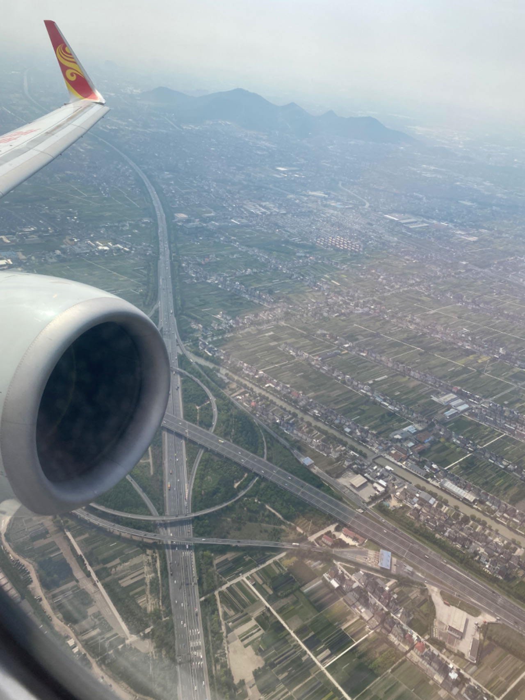

在海口，我们一起去了：海口钟楼、骑楼老街、云洞图书馆、世纪大桥，晚上去逛了小吃街去吃了海南粉、海蛎煎和清补凉。

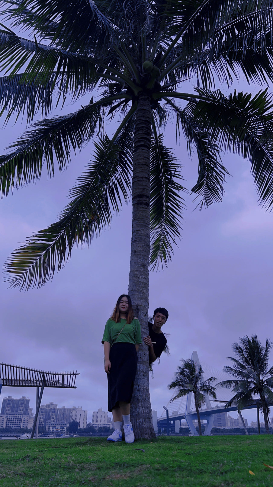
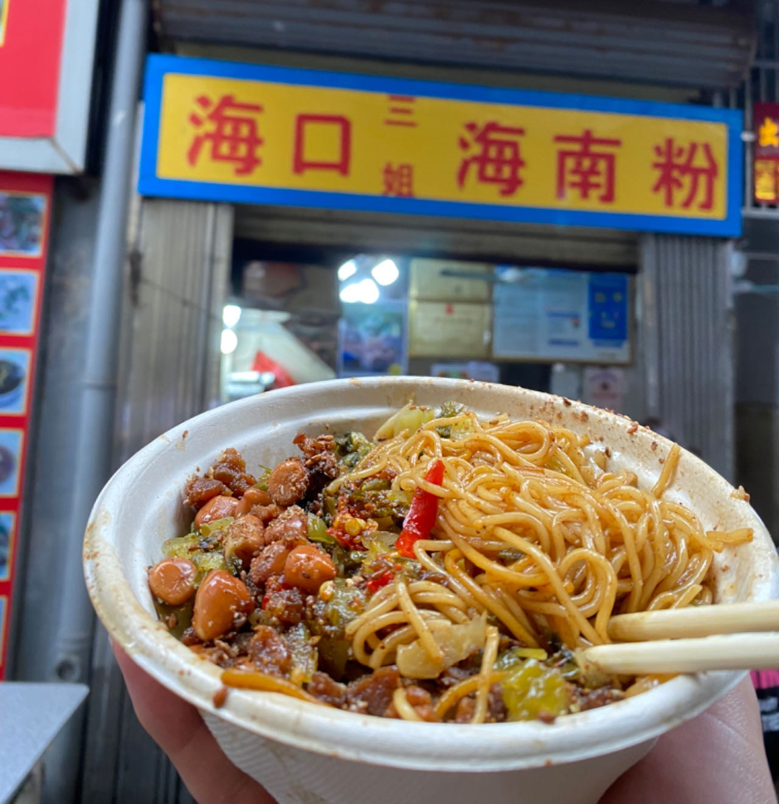

第二天上午，乘坐了从海口到三亚的高铁。中午左右到了三亚，下了高铁就是一股一股的暖风直面而来，这温度正好可以去海里游泳！

三亚是我非常喜欢的一座城市。在三亚，去了：三亚湾、天涯海角、椰梦长廊、西岛、鹿回头、南山海上观音。喝了不少的椰子，不得不说，当地现开的椰子就是好喝，我还寄回家了四个椰子。早餐吃的儋州米烂也非常好吃。

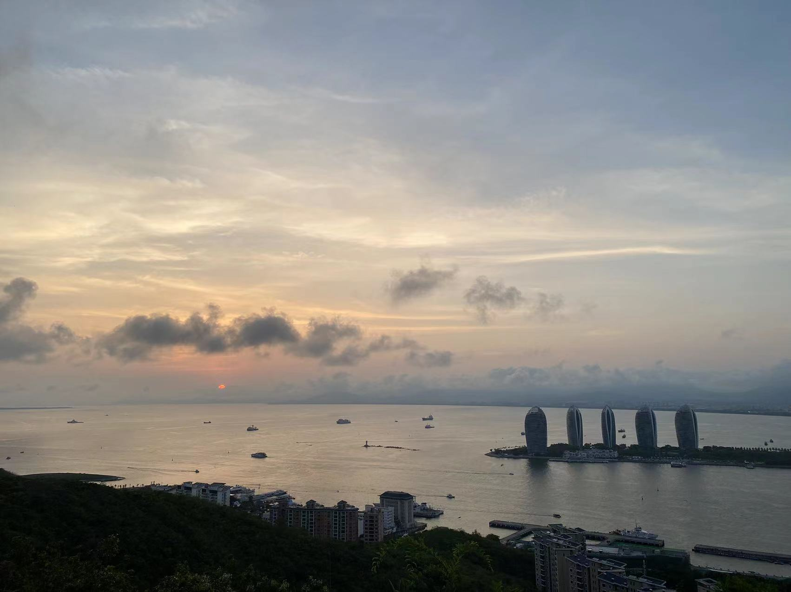

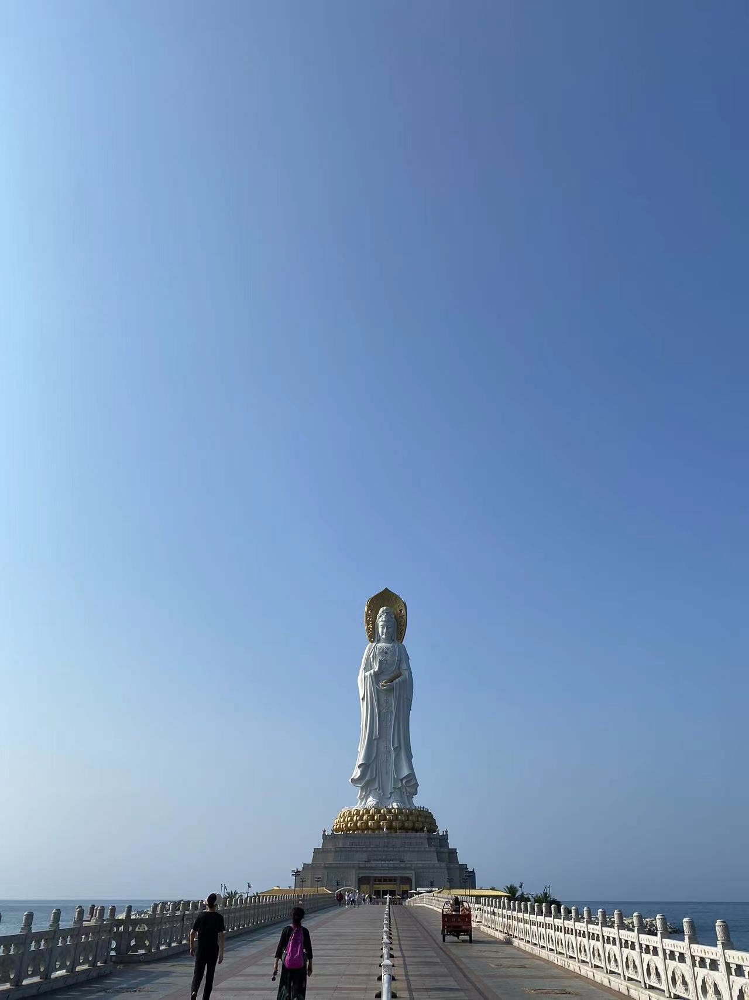

### 黄山

5 月 24 号，正好我提前抢到了黄山门票免费的资格，所以这天我来到了安徽黄山。

黄山下了高铁之后，乘坐大巴到景区，进了景区又换乘大巴到山脚下，到山脚下再换乘大巴走盘山公里上山。上午 10:16 分，我进了黄山的大门，准备开始徒步登山。

当天下着雨，我自己一个人背着书包，拿着登山杖开始登山，累了就找地方休息一下。历时七个多小时，我到了山顶，看到了迎客松。迎客松才是终点。上山的一路上，我走过了：光明顶、莲花峰、鳌鱼峰、一线天、迎客松。

晚上我打算在山上住一晚，可酒店需要 1200 一晚上，我听到价格果断放弃了。有很多同道中人，一起选择了睡在酒店的大厅里。一晚上是真难熬，山顶海拔很高，气温骤降，躺在地上，我只穿了一件短袖和一件冲锋衣，衣服是潮的，地是冰的，气温是凉的，怎么睡也睡不着。大厅里大概有三四十人，只有一个沙发，沙发上面有三个人提前占到了位置，其他人全部躺在地上。有的睡在门口的地毯上，有人在前台下面，有人坐在楼梯上靠着墙，有的人靠在冰箱旁边。

我换了好几个地方，最后钻到一个漆黑的角落里，应该是禁止入内的地方，我也直接钻进去了，里面狭窄，漆黑，但是地上有地毯，又背风。管他让进不让进呢，我先躲进去再说吧，困的不行了，啥也不管了。

天还没亮，很多人就起来打算去莲花峰看日出，我被吵醒也出去了，但是外面实在是太冷，我这衣服根本扛不住。更有甚者，有一个只穿了一个短袖的大哥，一晚上给冻的跟什么似的。这时候有个住店的大姐来前台，发现这位大哥衣服单薄，就问他需不需要棉衣，因为住店可以提供免费的棉衣，大哥也是接受了。穿上了一件红色的棉袄。

当时我就在旁边，哪位大姐问还有没有需要棉袄的？当时我就说：我需要！大姐也是又拿来了另一件棉袄借给了我。

这下好了，可以去莲花峰看日出了。

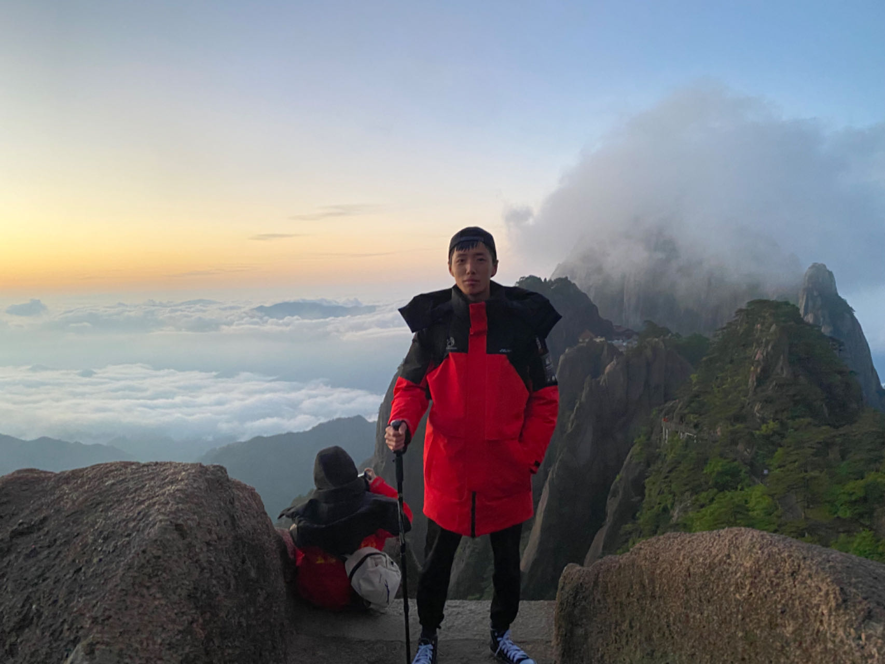

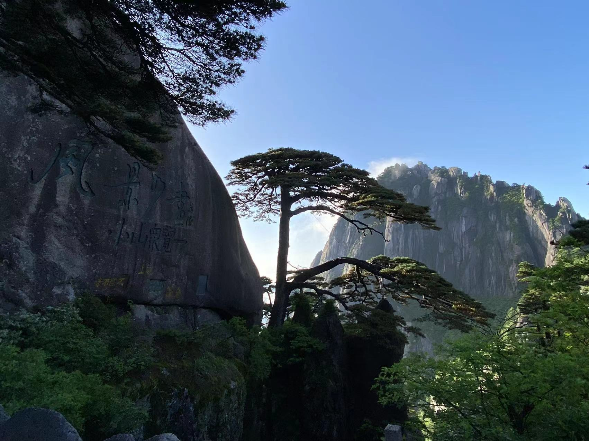

### 环游一小圈儿

六月底，老婆在第二家公司离职了。正好这段时间我们两个都处于离职期间，当时的打算出去简单环游一下世界。

开始计划是：大连 => 山海关 => 北京 => 西安 => 拉萨。最后一步打算直达拉萨！直达拉萨这个充满神秘色彩而又遥远的的地方。

所以在 7 月 1 日的时候，我们出发了，晚上乘坐了从宁波飞往大连周水子机场的航班。起初还按照计划进行，但是到了山海关的时候，再看去西安和北京的时候，首先人太多了，当时正式放暑假，而且很多需要预约的地方都已经约不到了。再一个就是去拉萨好多人到了之后都不适应，出现各种问题，还有很多人住院了。所以突然到了拉萨，也是比较危险的。所以在大连先去了老婆家，又到我家山海关。待了几天之后又去了天津一天匆匆的时间。在天津的第二天就回杭州了。

这一路上，我们一起去了：大连星海广场、大连傅家庄、大连海之韵、大连安越婚纱影视基地、山海关古城、天津世纪钟、天津解放桥、天津五大道、天津瓷房子、天津西开教堂、天津之眼。

### 亚运会

9 月 23 日，杭州开展了亚运会。自从去年我看了世界杯决赛，足球我也比较喜欢看。所以我们在 9 月 24 日的时候，一起去萧山奥体中心体育场看了足球比赛，我们各自都是第一次来体育场看比赛，现场氛围拉满！

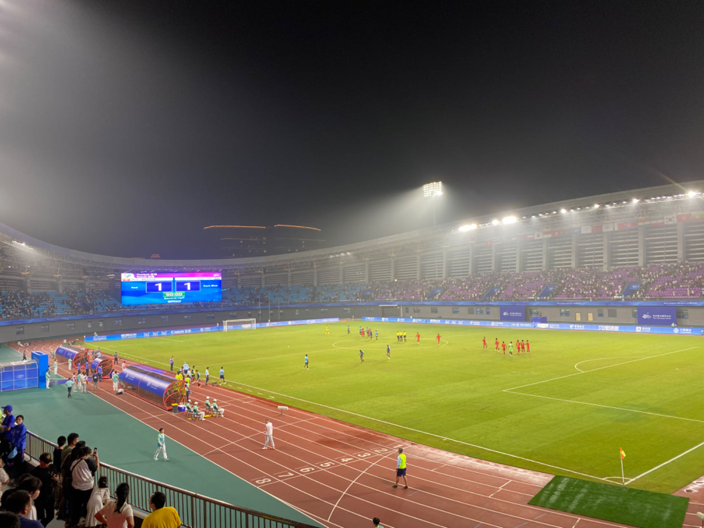

### 国庆节

十一的时候，我自己回了家，和以往一样的，下午 1:30 从杭州出发的直达列车，第二天早上 8 点到达山海关。

前几天出去玩了好几天，去了：山海关祖山、唐山动物园、唐山地震博物馆、唐山宴、唐山皮影主题公园。

后面又回老家呆了两天，玩了玩小时候我非常喜欢玩的内容：捞鱼、烤篝火：

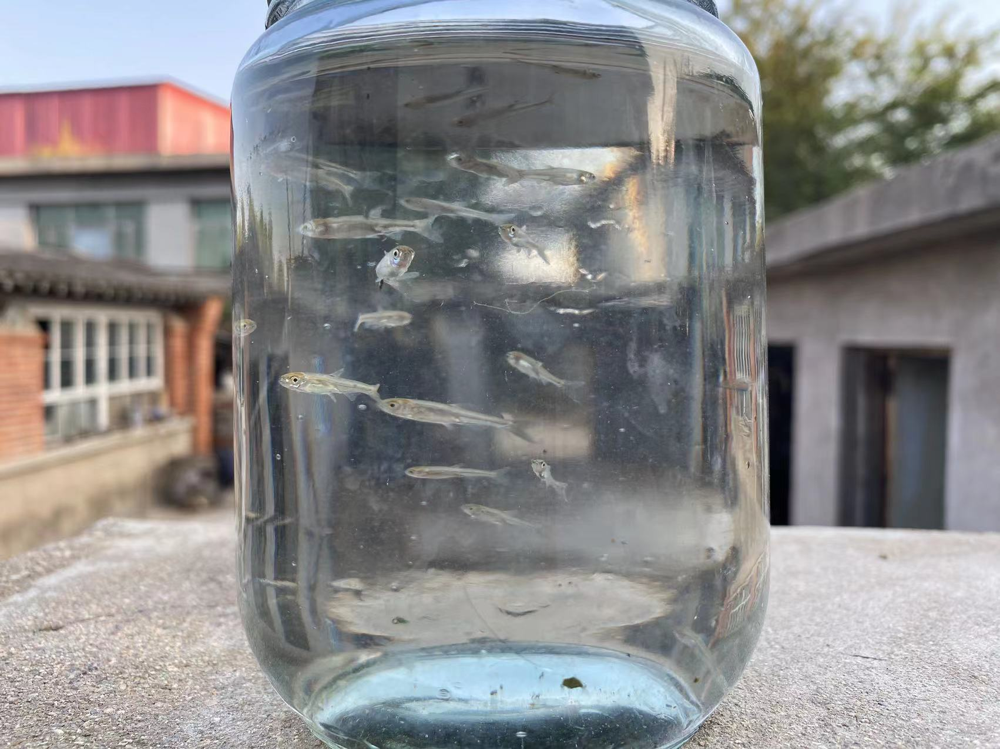

还去地里绕了一圈，庄里人都在收苞米。下面是我和爷爷在收苞米、收成、湛蓝的天空、爷爷在地里：

### 一小时北京之旅

10 月 5 日，国庆即将结束，我要回杭州了，从山海关到杭州的票实在是紧张，我本来打算直接无座回去，直接躺地上，老婆怕我太累，给我买了从山海关到北京的绿皮车，再从北京南到杭州东的高铁。

上午我先乘坐绿皮车，车上人挤人，真的是连坐在地上的位置都没有，哪哪都是人，有人蹲在洗手池上，有人站在门口，有人坐在行李箱上，有人被挤进了厕所里。到下午 2 点才到北京。

我已经很久没有来北京了，上次来还是好多年前，每次来北京都是不一样的感受。我下午 2 点在北京站下火车，高铁在北京南站 16:07 开车，还要两个小时的时间。我打算去看看天安门！

所以，火车开了门，我就第一关冲出去了，一直跑出站，在站前拍了个照片，再跑进地铁站，刷[NFC](https://baike.baidu.com/item/%E8%BF%91%E5%9C%BA%E9%80%9A%E4%BF%A1/9741433?fromtitle=nfc&fromid=5684&fr=aladdin) 直接一秒钟进站乘坐地铁。天安门东、西两站地铁当时没有开，可能是因为人流量太多的问题，所以最近的一站是王府井。我在王府井下地铁之后，又是提着行李全程奔跑，北京外面到处是围栏和安检，人还特别多。跑了很久，我在 14:41 分的时候到达的天安门。真的是每次来看到天安门的感受都是不一样的，真是兴奋。

拍了一些照片，发了朋友圈，给老婆打了视频电话，让她也看了看天安门。14:50 的时候，我感觉得去南站了，就又是全程奔跑，从天安门又跑回了王府井站。我只在天安门前待了**10 分钟**。

最终，我在 16:07 如期坐上了从北京南到杭州东的高铁。当坐上高铁的那一刻，我意识到：2023 年的所有假期都结束了。

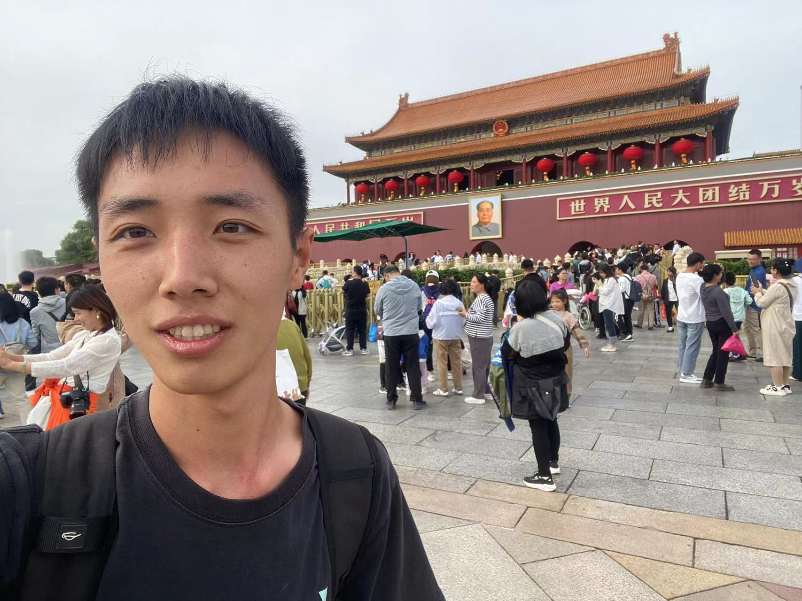
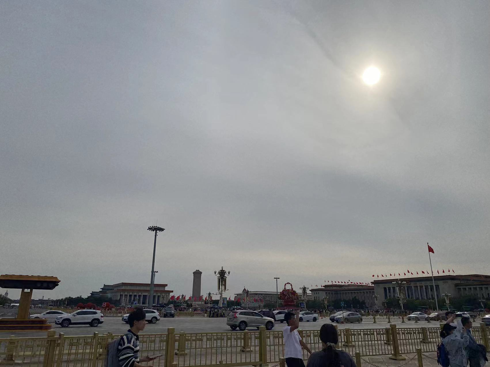

### 义远农场

12 月 6 日，我和老婆一起去了浙江湖州莫干山义远农场，这是 2023 年的最后一次旅行。在义远农场我们一起喂了山羊和牛、吃了围炉煮茶、住了帐篷、体验了挤牛奶、摘草莓、植物移摘、营地烧烤、做手工。真的是除了天冷点儿其它的都很好。

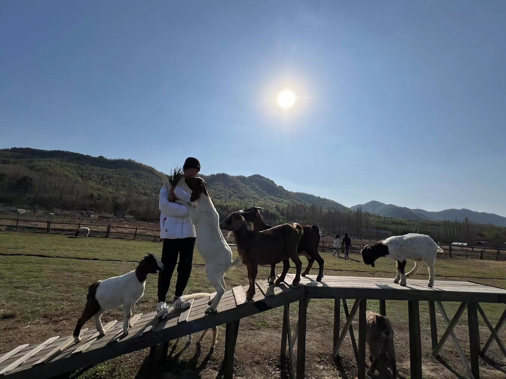

### 打游戏

主要玩的游戏就俩：英雄联盟和植物大战僵尸。

对于英雄联盟这种竞技类型的游戏已经不适合我了，现在玩的也少了，手速和反应完全跟不上，只会几年前就会的英雄，新的英雄出来一个买一个，但是从来没玩过，叫啥也不知道。上了黄金之后，就感觉打不动了。而且我只玩[武器大师](https://baike.baidu.com/link?url=nrsuV2ks4K3OxqFDTIPmqocdX9f2zY8QiqasWhwOZ2SA2WncFyQST4A0fqfCR_Kmi2bucmOIVj894nr5uaiunFC-aDdZgGdiga2jXRiFiVYAyoPJw4NIwDH7ihflT0D_Aer9pSi5qdAElNiugimaK_)这一个英雄，目前玩了 990 场。

另一个是经久不衰的游戏：植物大战僵尸，冒险模式打了两轮，所有的成就都集齐了，所有的物品都买了，无尽模式打了**168**轮，还在继续。

### 看电影

今年看的电影大概有四五部吧，具体那些忘记了。平时的话，我基本上不看电影，也没时间，都是在电影院看的。不过我认为最好看的，就是宝强自导自演的《八角笼中》。宝强之前的一些电视剧我看过几部，也比较喜欢他这个人，或许喜欢这部电影和这个人也有很大关系，而且电影也真不错。我去电影院看了两遍，记得上一次能让我去电影院看两次电影还是《战狼 2》。好的电影总是让人印象深刻，不像其它的，看完了之后，名字叫啥都忘记了。

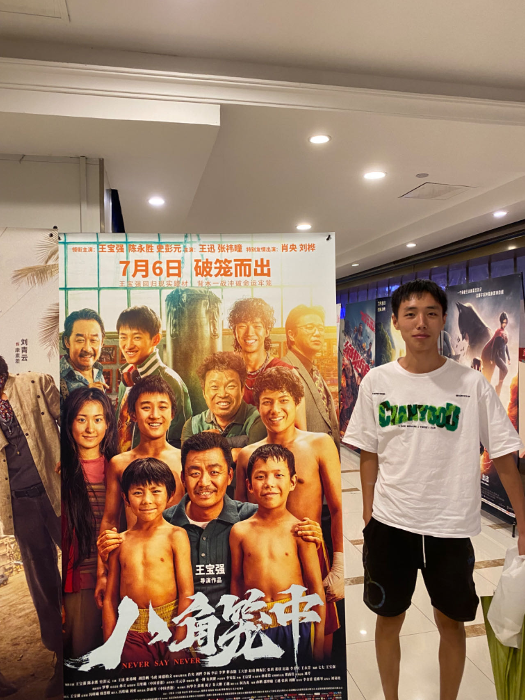

### 今年去的地方集合

每到一个地方我都会记录一下，今年一共走过了：杭州、上海、山海关、绍兴、秦皇岛、绥中、北京、大连、天津、宁波、海口、三亚、黄山、嘉兴、湖州，**十五个城市**。不同城市的大大小小近 **70** 个地点。

**一月**：杭州动物园、 山海关老君顶、 杭州岳王庙

**二月**：绍兴鲁迅故里、绍兴鲁迅祖居、绍兴百草园、绍兴三味书屋、绍兴墨池

**三月**：杭州湘湖、杭州马家坞、杭州会稽山、上海朵云书院、上海东方明珠

**四月**：杭州太子湾公园、杭州半山森林公园、上海博物馆、上海中华艺术宫、上海四行仓库、上海元代水闸博物馆、上海鲁迅故居、宁波老外滩、宁波三江口、宁波鼓楼、宁波天一阁、宁波美术馆、嘉兴南关厢

**五月**：海口钟楼、海口骑楼老街、海口云洞图书馆、海口万绿园、海口世纪大桥、三亚天涯海角、三亚椰梦长廊、三亚西岛、三亚鹿回头、三亚观音山、黄山光明顶、黄山莲花峰、黄山迎客松、黄山猴子观海

**六月**：上海特斯拉超级工厂

**七月**：大连星海广场、大连傅家庄、大连海之韵、大连安越婚纱影视基地、山海关古城、天津世纪钟、天津解放桥、天津五大道、天津瓷房子、天津西开教堂、天津之眼

**九月**：杭州动物园

**十月**：山海关祖山、唐山动物园、唐山地震博物馆、唐山皮影主题公园、唐山宴、北京天安门、良渚遗址公园、浙江大学西溪校区

**十二月**：浙江大学紫金港校区、湖州莫干山义远农场

每走到一个新的城市，我都会用高德地图打卡当前城市和地点，目前已经打卡 47 个城市。祖国实在太大了，什么时候才能全部打卡。

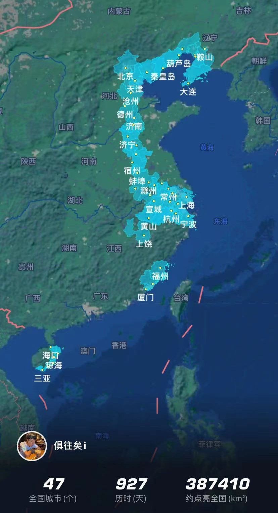

## 开源项目

主要做的还是 [fighting-design](https://github.com/FightingDesign/fighting-design)，今年基本上没有往外推荐过，大概涨了 100 多的 star，虽然不多，但是时不时就会有人点一下，也不错的。

其它的话，今年大多数做的都是一些自己研发的产品，有些也都没有开源，另外经常维护的有[vitepress-template](https://github.com/Tyh2001/vitepress-template)，另外做了比较有意思的是 [button](https://github.com/Tyh2001/button)，可以定制按钮的样式，一键复制代码，感觉还是一个小巧有意思的项目。

今年提交了 2632 次代码，去年是 5321，相比于去年少了不少，2024 争取多提交，哈哈。

## 作为面试官

11 月份，在新的公司工作的时候，还需要再招聘一名新的前端同学，我负责了在平台上发布职位和招聘面试的工作。一天可以收到好几十封简历。在不到一个月内，共九场面试，面试了 8 名新同学。大多数都是三到四年的工作经验。

面试我主要是会问一些技术相关的问题，另一个和我一起的同事会问一些项目问题。如果我们技术面通过了，会到产品面。

先说在平台上收到简历的质量，真的是啥样的都有，奇葩的也有，质量高的是真少。关于简历怎么写，我建议可以简单的参考下[大圣](https://github.com/shengxinjing)的视频 [程序员简历点评第二期：能吃苦和能吃](https://www.bilibili.com/video/BV1av411w7oa/?spm_id_from=333.788&vd_source=45b9ebc52408dcecd5ef3a71d406552e)，看完一定会有一定收获。就算没学到啥，也希望你工作三四年的简历上技术栈第一条也不要写会 HTML 和 CSS 了。

正常来说，一个面试官看一份简历，大概 20 秒钟，如果在这 20 秒钟没有让我对你产生情趣，那么就直接被筛掉了。如果在这几秒钟的时间里，我对你产生了兴趣，那么会继续仔细的看一看，发掘一下你的优点，如果还不错，那么就会提交上去作为下一轮筛选的候选人。

关于简历上写什么，先，放了 Github 地址，对于我来说绝对是加分项，我一定会点击进去看的，但是如果 1 年提交 10 几次，甚至没有。那么我就会直接筛掉，这就是放了地址还不如不放。本来我看了放 Github，加 10 分，一看根本没咋提交过代码，那直接-90 分。再一个就是有博客也要放上去，这绝对是加分项。还有的同学会把自己做的一些项目放上 git 地址，放 git 是很不错，但是 git 只有 1~2 次提交，这很明显就是为了放链接而提交，为了展示而提交，没有任何意义。

面试中，我作为纯技术面，每个人问的第一个问题就是：JS 的数据类型有几种？分别是什么？这样一个基础的问题，目前为止我只遇到一个人完全的答对，具体有那些，可以参考[JavaScript 数据类型和数据结构](https://developer.mozilla.org/zh-CN/docs/Web/JavaScript/Data_structures)，之后我会问问比如：高阶函数是什么、高阶函数解决了什么问题、类如何继承、原型方法和静态方法、事件循环机制等。我比较看重的就是数据类型了解不了解，函数和类玩的 6 不 6。除了硬性技术之外的，我比较关注是否做过开源，对 AI 是否了解，比如：你觉得自己还要什么需要提升的、AI 相关的产品了解什么、有没有参与过开源项目等。

面试几个人下来，给我的感觉呢，其实我更希望面试者会更主动一些，比如主动自我介绍，主动介绍自己的产品，延伸或者展开一些话题，对各个事物有些自己的看法等。但是大多数求职者都没有做到这样，给我的感觉就是我在问，你在答，而不是感觉是在聊天。

整个过程中，我都会带着电脑将求职者回答的每个问题，都做个简单的记录，并且这个人的整体表现也都会记录下拉。我也遇到了一些面试态度不端正的，对于不端正的，下面是我的笔录：

站在不同的角度，换位学习交流一下，也不错，一种不一样的收获。

现在招人面试还在继续。

## 特斯拉

今年 [model3](https://www.tesla.cn/model3) 发布了焕新版，价格也涨了不少。今年上半年试驾了老版本，试驾记录可以查看 [Tesla Model3 特斯拉试驾体验](https://www.douyin.com/user/self?modal_id=7206698623067770149)，视频莫放量也挺高的 60 多 w。新版本的 model3 没有试驾，只是去店里看了看，改动的也不错。

## 结尾

这是写年度总结的第二年，感觉今年相比于去年，学到了更多新的东西，也更加充实了。今年的总结也是写了不少，大多数的内容都是在地铁上写的。

大家也可以添加我的微信：**T2000000000000000001**

- 如果有技术相关的问题，可以找我一起讨论
- 如果对我的内容有任何建议，欢迎提给我
- 如果对海外的岗位感兴趣，我可以提供一些资源
- 如果想参与我的开源项目，我可以拉你进群一起贡献
- 如果对开源感兴趣，或者有那些项目希望我也可以参与的，也可以邀请我
- 如果有新的技术或者新的事物，我们可以互相分享

今年我的总结就分享到这里，如果你也有类似的年度总结，也可以评论分享一下~

祝各位 2024 年每天开心~

我的 Github：https://github.com/Tyh2001
