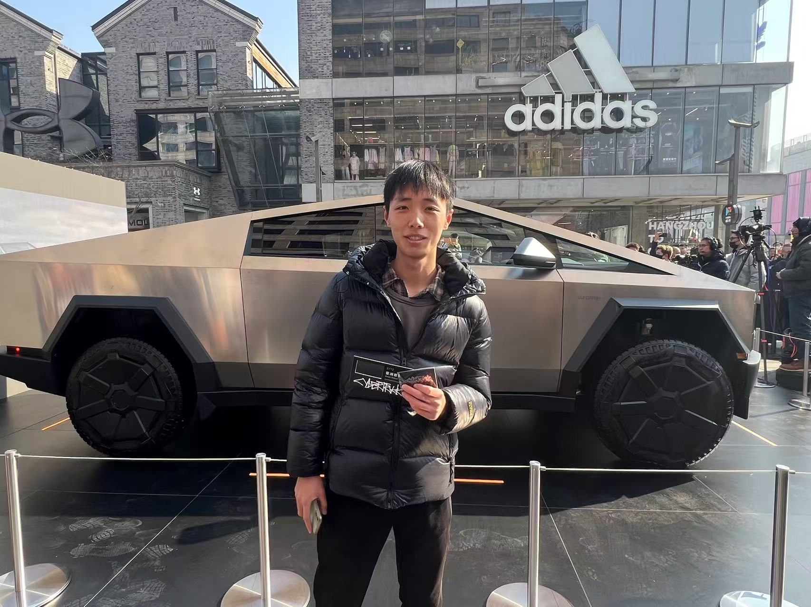
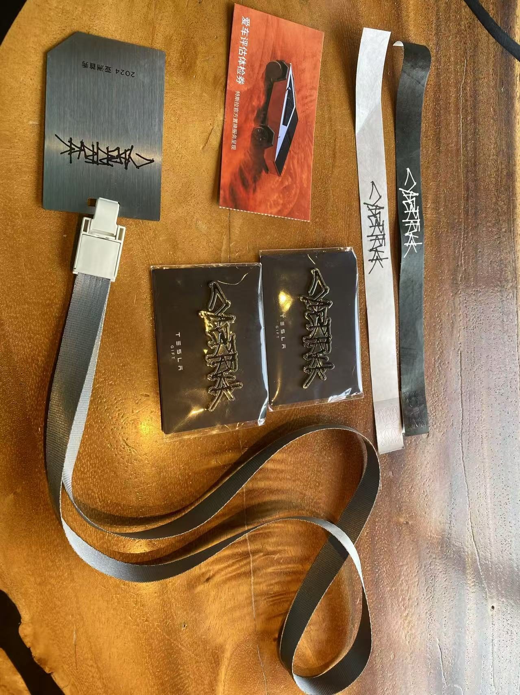
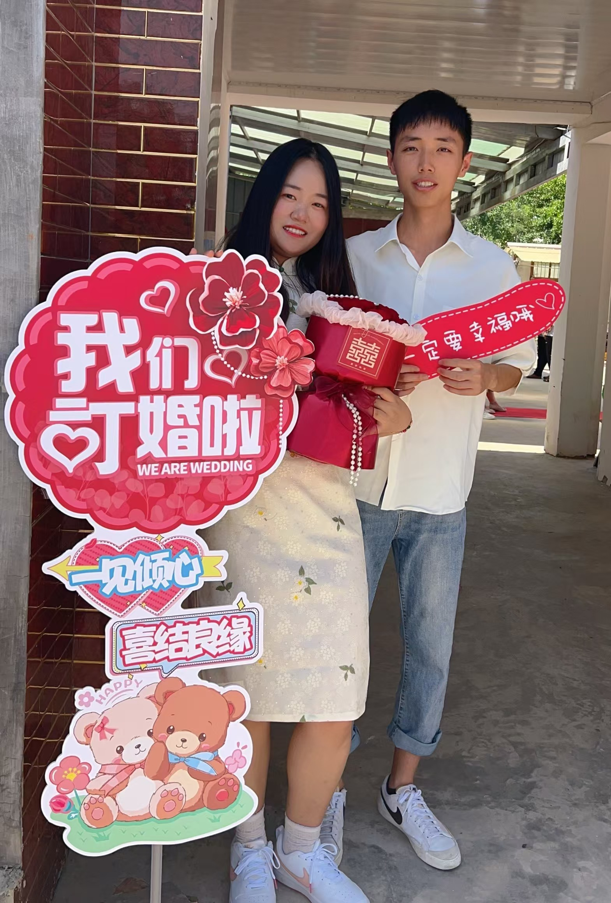
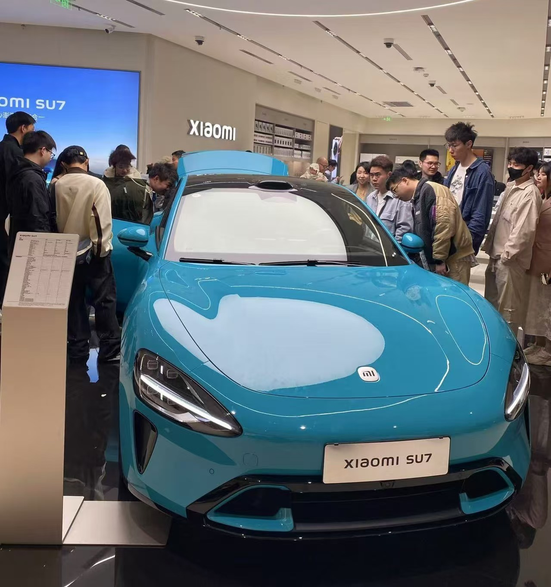

# 田同学 2024 年度总结

## 前言

我将告别前端开发者的身份，迈向成为摄影师的全新篇章。

每年开始写年度总结的时候，我都会打开手机的相册，看看各个时间段都发生了什么，我都在做什么。

## 分隔符

一月份的时候，特斯拉 Cybertruck 全国巡展，杭州首秀，我去看了它的展览，并且收集的很多的周边：

这个车真是个杠杠硬的家伙，我一共参加了两次展览，磁吸贴和这个铁质的挂牌都收集到了，还有一些手环和杂志等等。

## 过年

二月份就过年了，

## 独立开发

三月份的时候，我在闲鱼购买了人生中的第一台苹果电脑 MacBook Air，花费 4098，因为我打算开始学习 swift，自己做独立开发，做一个属于自己的 app。

在 23 年离职期间，我就有这样的想法，又经过了这小一年的尝试，中间试错了好几遍，代码完全推倒了好几次，发现只是考自己的想象，无法将一个产品做好，还是要像公司里的流程一样，要有足够的考虑，需要有产品文档、原型图、设计稿等。

在今年中旬的时候，我终于是将整个都想好了，自己学习了 [Axure](https://www.axure.com/) 画了每个功能详细的原型图，又自己写了产品文档，还找了之前认识的一些产品经理和开发者让 TA 们去看了一下，都给我提了很多宝贵的意见，我将所有人给我的建议也都记录了下来，对于产品未来也都有了非常明确的方向。

我自己一个人负责：微信小程序、IOS、后端、服务端、数据库、产品，现在就差了一个设计师了，我在 𝕏 找了很多国外设计师的作品进行了参考，大致的风格在脑海中也有了一些样子，但是自己还是画不出来，哈哈。

后面我在淘宝上找到了一位设计师，先让她做了一个首页，其实第一版做出来我感觉还是眼前一亮的，比预期中还是好一些的，只要再将部分细节稍加修改就可以了。就这样，这位设计师帮我做了整个产品的设计稿，总共我大概花了 1000 块钱左右。

下面是部分设计稿的截图，可以简单的看一下，因为我的这个项目已经完全开源了，后面会放开源连接。

其它的内容我都基本上学过，写起来也不算费劲儿，但是 swift 是一门全新没有接触过的语言，做 IOS 的时候，进度还是比较慢的，基本上就是边学习边做，很多在前端实现的效果到了 swiftUI 中也不知道该怎么写。一直写到了八月份的时候，基本上大体也都写的差不多了。

在当时我看来，以目前的程序员来说，你在大厂工作不算厉害，真正厉害的是，无论走到哪里都可以工作，比如做一些海外的岗位或者自己做独立的产品来赚钱，我的目标就是边自己做着自己的产品，，边去投递海外的岗位，因为这样并不需要媒体都去公司上班，不论走到哪里都可以工作，可以边玩边工作。为此，还专门去研究如何才能办理一张海外的银行卡，这样方便到时候可以赚美元，哈哈。

本来打算去办理汇丰的卡，需要去一趟香港，但是比较麻烦，后面在网上又看了很多，发现 OCBC 可以直接在线办理银行卡，而且还可以将实体卡邮寄给你，所以我当机立断办理的银行卡，大概一周左右就收到了人生中的第一张海外银行卡：

## 离职

在八月份的时候，我在公司离职了，结束了无限重复的工作，

## 我们

这一年，对于我们来说是重要的一年。

### 订婚

在 6 月 9 日这一天，我们订婚了，在老婆家里举办的，我们一起搭建了现场的布置，双方的家长和亲戚朋友在一起愉快的吃了饭，一起聊了很久，一共花了两天一晚的时候，我们的订婚完美完成。

### 领证

在三年前，我们在 [Soul](https://www.soulapp.cn/)上认识，八月份同年的八月份正式在一起。

今年的 8 月 8 日，我们在杭州的临平民政局领证了：

### 目的地婚礼

我们在很久前就在短视频平台上看很多人都在做现在非常流行的目的地婚礼，没有接亲、没有伴娘、没有车队，只有两个人在玉龙雪山下举办的婚礼仪式。

所以，我们也报名了目的地婚礼，在云南丽江。

再出发前的几个月就沟通了很多的事宜，比如场景、拍摄、服装等等，早早的就开始准备，最后确定是在三木妍。

我们定好的举办婚礼的时间是 9 月 17 日，也就是我生日的这一天。在 15 日的凌晨，我们就从杭州萧山国际机场登上了飞往丽江的航班。

16 号的晚上，先选好了明天拍摄的服装，17 号一大早，老婆就先起来去化妆了，我点了简单的外卖我们一起吃了一些，

## 短视频

有一天我刷短视频的时候发现了一个好玩的，博主花了 28 钱买了一张从杭州南站到杭州东站的高铁商务座，去体验的商务座的休息室，还有免费的午餐可以吃。

于是，我也去体验了，我花 32 块钱，买了一张从杭州东站到临平南站到高铁商务座的，正好卡在午饭时间，也顺利的蹭到的饭，并且将全程记录了下来在各大短视频平台发布了出去，结果直接爆火了一波，从这开始，蹭着这波热度，我也正式进入了短视频圈子。

在去年是也是考虑做短视频，也尝试了一些题材，都没有做起来，一旦做不起来我就会直接将账号注销换个题材再来，但是这次，我决定做个旅行博主。

后面基本上保持日更，每天都出去拍视频，当天剪完就会发布，这次我感受到了比以往效果更好了，所以一直在坚持，到现在，我发布了近 90 个视频，中间直播过几次，也收获了一些粉丝。

## 旅行

### 千岛湖

### 上海

上海玩看了三星堆

### 绍兴

㹧犭茶湖避塘

大禹陵

### 云南

我和老婆到了云南，第一站是丽江，第一天下午到时候才到，先在丽江古城简单的逛了一下午。

第二天一大早，我们早早的起床去的玉龙雪山景区，先去了牦牛坪，在牦牛坪回去的路上去了蓝月谷，最后去了冰川公园。

09-17 第三天是举行了目的地婚礼。

09-18 第四天早上选完片之后，去了丽江的束河古镇。

09-19 第五天早上到达丽江站，踏上了大理的行程。到了大理酒店住下之后，去了大理古城溜达了一圈，后面去打卡了网红路宏胜路。

09-20 第六天我们骑着电动车环洱海骑行了一圈。

09-21 第七天，我们出发去了昆明。在昆明我们去了海埂公园、滇池、斗南花市、双桥夜市。

09-22 第八天，老婆要回杭州上班了，我继续出发到了成都。

### 成都

09-22 成都我先去了东郊记忆、小酒馆、太古里

09-23 熊猫繁育基地、川剧、太古里、环球中心

09-24 出发去重庆

### 重庆

09-24 李子坝、洪崖洞

09-25 白帝城、三峡之巅、解放碑

09-26 回杭州

### 其它

和老婆一起了中国茶叶博物馆

神仙居到车票有折扣，我去了台州神仙居

## 摄影

### 为什么？

看过我去年的年度总结的同学都知道，去年离职期间，我找了 5 个月大工作才找到。

之前也和同学交流过：如果你后面离开杭州回家，你还会再做开发吗？大家都回答基本上都是一致的，认为回家都不会再做开发了，按我家秦皇岛那边来说，开发的岗位首先很少，再一个基本上只要全栈，老板都希望节约成本能让你一个人干完所有的工作内容，不但工资不高，还要 996，这谁受得了？哎，就算你找到了工作，马上迎来 35 岁中年危机，你被公司开了，你干啥去？

所以我也在考虑，我要是不每天对着电脑敲代码，我还能去做什么呢？在杭州目前的话，比如室内对着电脑可以去做客服、运营等等，室外的工作还有网约车、骑手每天都在疯狂的招人，但是这些工作好像都是个人就能干，这些没有技术含量的工作好像也不是长久之计。

我就在招聘网站上刷，看到有：主播、摄影师、客服之类的岗位推荐。我一看，之前去丽江拍摄，还要十一婚礼的拍摄，我都有注意过他们，拿着相机一直拍拍拍就好了，好像挺简单，正好我平时也经常拍照，还做短视频，我可以去试试摄影师。于是我就投递了摄影助理。

### 摄影助理

我看平台上写着摄影助理不需要经验，还有师傅带着学习，还有上手拍照的机会，我一看这不错啊，我感觉有手就行。投递过去之后顺利的去面试了。

面试的是一家摄影工作室，也是专门做一些婚纱照等的拍摄，大厅陈列着很多的婚纱哦和秀禾。

是一个人事面试的我，显示问了问的一些基本情况，然后问我为啥要做摄影助理等等等，简单聊聊嘛，对我来说也不是啥问题，然后让我无语的是，她居然问我你知道什么是摄影什么是摄像吗？这两个词我还真是没有专门去注意过，我只知道好像拿着相机的人，叫他摄影还是摄像都可以，就是感觉好像一个是拍视频一个是拍照片，其实我认为拍视频还是拍照都是一个人呢，我就说：“一个是拍视频一个是拍照片吧？”，她又继续问：“哪个是拍视频，哪个是拍照片呢？”，这对我来说，还真不太清楚，哈哈，我看着天花板思考了一下，说：“摄影是拍视频，摄像是拍照吧？”，人事说：“小哥，你现在连摄影还是摄像都没有分清，应该是摄影是拍照，摄像是拍视频，那你想要做那个岗位呢？因为这俩是两个完全不同的岗位”。当时我也没有很确定，只是随便说了一个，她又继续说：“你要是真的能下定决心学习的话，我们这边有专门培训的课程，可以在几个月能给你培训成能直接干活的摄影师，如果你想要选择当助理的话，可能几年都学不到啥的。”，我一听，这不就是坑嘛，学习几个月要小一万块钱，我一分钱赚不到还要先交钱，还说如果我没有钱，可以先交一部分，后面工作在我工资里扣除，慢慢还清，简直无语。

第一次接触摄影的糟糕的面试也就结束了，虽然说糟糕到了极点，但也是有收获的：首先让我知道了做不管是摄影还是摄像，都不那么的容易；再一个，让我知道了什么是摄影和摄像，哈哈哈。

### 学习

有一天早上起来刷短视频，刷到了一个摄影教学的直播，叫 [吉像摄影-梵星](https://www.douyin.com/user/MS4wLjABAAAAJYrkPaZzM6Y2KVB6hq8XkmmGeP279K3b2t6ZyFP4XRjFvgsa3BSwIOhwHZgKAvsg?from_tab_name=main&is_search=0&list_name=follow&nt=0)，老师详细的讲解相机的使用，还要各种参数如何调整，我感觉老师讲的不错，看了一个多小时的直播，老师还在直播间里面卖课，只要 99 元，当时也是脑子一热立刻就下单买了。买完之后课程是需要短信验证激活一下的，我一直都没有激活，因为激活之后就不能退款了，我也不确定自己能不能去看。

后面又经常刷到摄影相关的视频，感觉自己越来越有兴趣了，所以在一天晚上讲课程激活了，直接开始学习，这老师讲的可真好，每一节课我都听懂了，大概两周左右，我就讲所有的课程都学完了，还做了一些笔记。

### 面试摄像

这期间摄影和摄像的岗位的都在投递，能不能入职先不说，只要让我去面试我就去，我认为面试是帮助我进步最快的。

通过之前的线上课程学习，我认为自己又行了。继续去投递摄影摄像的岗位，正好有一个公司在招聘摄像，问我有没有之前的拍摄作品，我就直接讲自己的抖音账号分享过去了，让她看看我之前做的短视频，结果我成功获得了面试机会。

到了公司之后简单和人事沟通了下，和人事聊天，只要你足够自信都能过，我成功的进入了第二轮试镜环节，需要拿着相机实际的去拍摄给导演看看效果。

要知道，在这之前，我从来都没有摸过相机，就直接去试镜了。我找到了面试的导演，他当时正忙着拍摄，我就跟着他帮他拿着三脚架和相机，帮忙打打光，做着好像助理的工作，等他拍完，让我拿着他的相机去拍了一个不是那么重要的客户，是一个儿童的拍摄。当时我就靠着在线上学习的知识，拿着他的相机，使用的还是手动对焦模式，架着三脚架不同的角度拍了一些视频。

拍完之后，他让我自己把视频拷贝到他的电脑上。过一会他回来一看，脸上漏出无语的表情，说我拍的根碳一样很，说我的 ISO 是怎么调的？又问我一些问题我也没有答上来，就说我的面试没有通过。

### 线下课

老婆发现杭州本地宝可以报名摄影的夜校课程，学习完之后还可以考证书，一共五节课，五百多块钱的学习费用，于是我就立刻报名了，在课程是提供相机的。

前三节课是一个女老师给我上课的，她给我们讲了拍摄技巧、曝光三要素、构图等等。感觉还不错。

后面两节课，换了一位新的老师，这个老师和我一个姓，我们都姓田，他是国家一级摄影师，自己有摄影工作室，每天都出去拍摄，给我们讲的课实在是太精彩，讲了很多他对摄影的理解。教了我们静物拍摄、构图、人物拍摄等，还给我们每个人的作品都做了很详细的点评。

这个课程学完后，让我离专业摄影师又近了一步。

下面是老师在给我讲课中，和我的静物拍摄作品：

### 买相机

相机和镜头也看了好久，开始我在看佳能的 R7 和 R8，一个鸡头一个凤尾，感觉都有缺点，它俩结合起来就说 R62，但是又太贵了。又一想，要不先不要投入那么大了吧，直接买个佳能的 R10，再配个小痰盂镜头，1W 以内轻松解决，就和老婆一起商量。老婆给我的建议是：如果你想好了做这行，咱就直接买最好的。那行了，既然这样说的话，佳能直接不考虑了，直接索尼 A7M4 了。

相机近期一直没有优惠，我先在闲鱼上买了个一镜走天下的镜头：24-105 F4 G OSS 的镜头：

在 12 月 12 日这天，我买了索尼的 A7M4：

## 小红书

在做短视频的同时，最近也正式开始做小红书了，小红书主要分享一些摄影相关的内容，可以分享一些相机、拍摄教学、摄影作品等等。

## 其它补充

4 月 6 日的时候，我和老婆一起去杭州大悦城看了小米 SU7：

5 月份在叮咚买菜上参加活动获得了两只相守蟹来养，但是没过多久就被养死了。

8 月 9 日，在 Apple 西湖逛的时候，店员和我说空出一个 VersionPro 的体验名额，问我要不要参加体验一下，这次偶然的机会，我体验到了苹果的这个新产品：

十月

- 蘑菇街兼职
- 邮戳卡
- 等报纸
