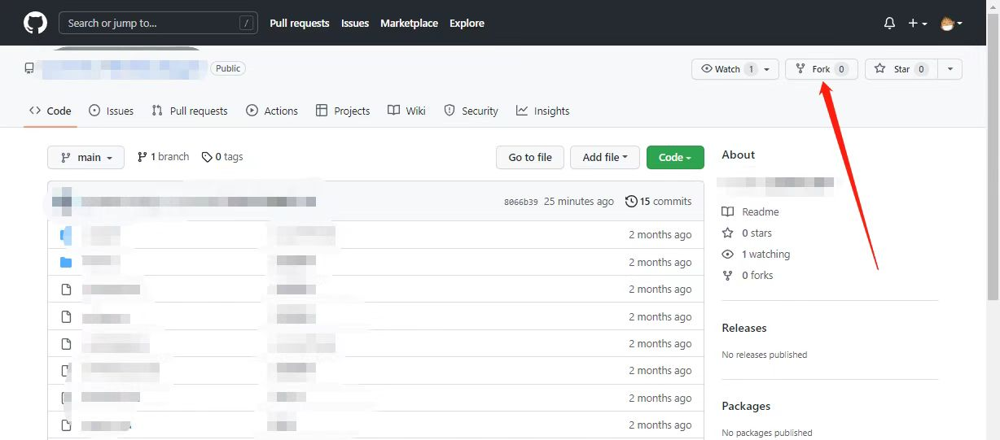
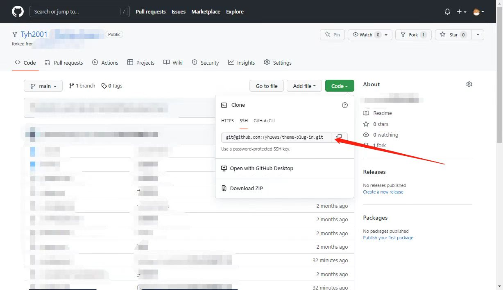

# Github 如何提交 PR？

## Hello

大家好，我是[田同学](https://github.com/Tyh2001)，大家可以加我微信 `T2000000000000000001` 一起共同学习。

`PR` 全称：`Pull Request`，提交了 `PR` 之后那么你就会成为贡献者其中的一员了，下面这篇文章向大家介绍一下 `Github` 上提交 `PR` 的方式

## Fork 仓库

首先你需要进入你想要参与贡献的仓库，点击右上角的 `Fork` 按钮



点击 `Fork` 之后会有接下来的提示，直接点击 `Create Fork` 即可


这样你的账号上就会有一个和原仓库一模一样的仓库了，就可以进行修改了


## Clone 仓库

`Fork` 完之后，你就可以像 `Close` 自己的仓库一样，将仓库 `Clone` 到本地，就可以本地进行修改或运行了



## Git commit

在本地修改好的项目，可以按照正常流程直接推送到仓库

```shell
git add .

git commit -m 'xxx'

git push -u origin master
```

## Pull Requests

推送到远程仓库之后，需要进入项目操作栏的 `Pull Requests` 菜单中，点击 `New pull requests` 发起一个新的 `PR`


之后再点击 `Create pull requests` 创建拉取请求


最后输入标题和信息之后，即可点击 `Create pull requests`，便可以提交 `PR` 了


## 避免分支冲突

在每次提交 `PR` 之前，需要保证你拉取的代码必须是最新的，可以在修改之前先拉取一次最新的代码

拉取最新的代码可以在仓库的 `Fetch upstream` 选线中，点击 `Fetch and merge` 进行同步


