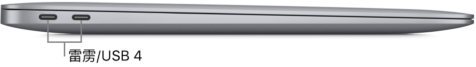

# 2020 款 M1 MacBook Air 使用感受

## 官方

- 官网介绍： [MacBook Air (M1, 2020) - 技术规格](https://support.apple.com/zh-cn/111883)
- 发展史：[识别 MacBook Air 机型](https://support.apple.com/zh-cn/102869)

## 介绍

这是我在 2024 年 3 月 10 日，花费 4000 元购买的二手 M1 MacBook Air，当时电池最大容量 98%，循环 90 多次。

当时是在咸鱼平台联系，线下进行的验货交易。

## 为什么

因为在当时，这款电脑是苹果唯一的一款保持着圆滑角度的电脑，可以看下它的侧面的轮廓：

并且它真的非常的轻，尺寸很小。最轻最薄也成为了我最喜欢的原因。

## 问题

问题的话，基本上没啥，我认为我算是安全下车了，没有踩雷。

但是唯一的问题是，它的蓝牙不太好用，我的一个随便买的耳机，基本连不上，连上几秒钟就自动断开，现在还不清楚具体是耳机的问题还是电脑的问题。

## 续航

简直没得说，出门一天完全不需要带充电器。

## 附

这是当天交易时候拍的照片：[My first MacBook](https://x.com/tyh20011/status/1766755791644885359)
