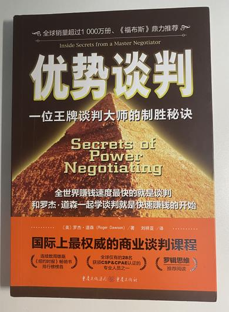

# 看书的分享

## 《JavaScript 高级程序设计 第四版》

人称：红宝书。重磅推荐，推荐第一本阅读，整体阅读体验非常好，全部使用 es6。详细了介绍了函数、作用域、原型、类、promise、proxy 等，还有一些新的 api。基本上读完之后可以让你对 js 的体系有一个完整的认知。唯一明显的不好的地方就是它的章节顺序安排的并不合理，比如把函数的章节放在了原型的后面，这显然是不合理的。不过也有一些冷门的章节，比如 canvas ，这本书我整体看了两遍多，一直都没看这一章。但是这些不足并不影响它成为经典。JavaScript 高级程序设计，买它~

## 《你不知道的 JavaScript》系列

人称：小黄书。分为上中下三册，用一句话来描述就是：书是一册比一册厚，内容是一册比一册 low。上中下三册里，其实我最推荐的只有上册。因为上册将 js 的作用域、闭包、this、原型、事件委托，这些比较重要的内容做了一个非常详细的介绍。其实这本书的描述有些地方也挺抽象的，读完红宝书之后再看的话，更能明显的感觉到，两本书写作的风格还是有很大差异的。

对于小黄书的中册和下册的话，其实可读性对比于上册就降低了很多，上册主要是描写了一些 promise 等，下册基本上就是 es6 了，其实这些在红宝书中都已经有了。所以只推荐买第一册的小黄书，第一册是最薄的，一共只有 200 多页，但是内容是真的不错，我看了大概有两遍多，其实结尾的有些地方仍然都没那么看懂。所以呢，建议红宝书看完之后，再来看小黄书。

## 《http 权威指南》

对于前端工程师来说，网络方面也是需要了解一些的，这样更能提升我们的内力，基本上网络的书，能够完整的读完这一本 《http 权威指南》就已经足够了。但是这本书对于我来说，读起来还是非常痛苦的，因为里面基本上全部都是网络相关的理论知识，并不像其它书籍，有些代码段还可以照着敲一遍，所以读起来比较枯燥。最近也在继续看这本书。

## 《Vue.js 设计与实现》

2022 年刚刚问世的一本新书，是 vue 核心成员霍春阳写的一本书，目前我只是看完了前三章，内容就已经惊艳到我了，基本上每一章都是纯干货。比如 vue3 的响应式的实现方式啊，读完之后，你就会彻底的明白 proxy 是如何实现响应式的。再往后我还没有看到。总之呢，随着 vue3 变得越来越成熟，这本书也将是 2022 前端必看的一本书了。

但是呢，任何的框架都会过时，这本书会不会随着 vue 的过时而过时呢？其实不会的，里面的设计思想是我们可以一直沉淀保留的。

## 《学习 JavaScript 数据结构与算法 第三版》

昨天刚到的一本书，还没开始看，也是很多人推荐的算法书。

## 《算法 第四版》

众多人称之为永恒的经典算法书。涨薪必备，但是它是用 Java 写的，所以我们前端工程师就需要使用 js 重写一遍了，整体来说是我所有书中难度最大的，我还没开始看，暂时先是收藏状态。

其实如果想要学习算法，第一本书还是建议看《学习 JavaScript 数据结构与算法 第三版》，相比 Java 入手，咱们前端还是先从 js 入手会比较友好一些。

## 《优势谈判》

除了技术，其实我们还需要一些横向扩展的书籍，这本《优势谈判》在我看来，主要可以帮助我们在面试的时候如何和面试官谈笑风生。其实最主要的就是如何谈钱，那么这本书的前三章基本上是纯干货，教你在各自场合的谈钱的技巧，第四章和第五章呢讲的就是一些谈判的策略，第五章以后呢，我感觉就没有之前那么干货满满了，不过也可以作为了解来看看，也是很不错的。

## 《谋事》

这本书是德云班主郭德纲的一部作品，全书 33 个章节，每个章节都是独立的，前后互不相关，每一章都是两到三个专门的小故事，基本上都是古代的一些事情，和一些历史上的人物。每一章内容也不是很多，读起来还是比较舒服的。
