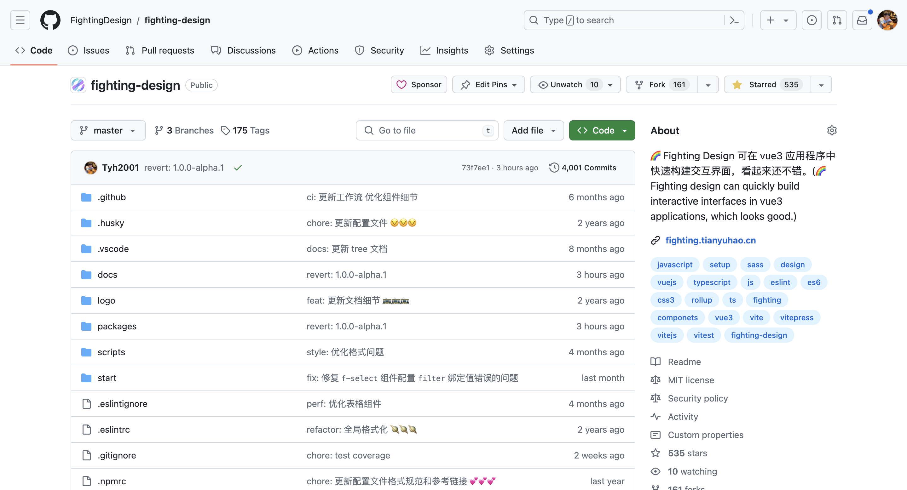

# 2024 年

## 2024-01-04

2023 年一整年都没有记录，哈哈，今年开始记录一些内容吧。

最近开始写 2023 的年度总结、学习 react、学习服务端，再写一些自己的项目，最近事情还挺多的。

## 2024-01-29

最近开始学学 Swift，对这个语言还是很感兴趣

## 2024-01-31

今天是 1 月份的最后一天，我正式开始学习了 swift，今天晚点把记录的笔记都整理下，还有之前的 react 笔记都整理下

## 2024-03-12

时间过的可真快，一转眼过完年就三月份了。

上周末去线下交易了一台 Macbook Air，最近用起来非常的不错，最近一直在学习 Swift

## 2024-03-15

这两天开始使用 Swift 写了一个小红书项目 [small-red-book](https://github.com/Tyh2001/small-red-book)

## 2024-03-25

今天写了 [开端](https://blog.tianyuhao.cn/article/article/23.html)

## 2024-04-03

时间真快，最近事情越来越多，明天是清明节放假，打算去上海玩。

今天将 swift 真机预览搞定了，写了笔记。

今天看群里一些人说国内原生 IOS 开发已经凉了，新手是找不到工作的。但是其实对我来说无所谓，我并没有指望靠 Swift 在国内可以找到工作。

## 2024-04-17

又快要到五一了，今天 10:30 就要抢五一到票了，还没想好去哪里。

最近的的事情还挺多，有时候忙的都不知道该干什么了，这里列举一下：

1. 完善 [fighting-design](https://github.com/FightingDesign/fighting-design) 的一些细节，和单元测试覆盖率。不新增组件了，只是将现有的组件维护好，更加健壮就可以了。

2. 学英语。电脑使用 [earthworm](https://earthworm.cuixueshe.com) 学习，手机使用多邻国和看一些抖音的英语听力练习，将学习的新句子和单词会记录到这个博客上面，现在还有好多截图还都没有记录完成。

3. 学习 Swift，我的 Swift 项目还要保持一个很快的更新节奏，学习更多的开发流程和方式。

4. 淘宝店。最近开通了淘宝店，打算开启前端代做、文案代写等服务，昨天刚刚上架了商品，现在还有很多问题需要处理。之前没有这方面的经验，还需要多研究才行。

5. 对于自由职业的一些思考。希望可以学习更多的东西，希望在未来一年中可以找到一份远程的工作。

6. 最近有时间会把自己的人生经历记录下来，写成了 [storybook](https://blog.tianyuhao.cn/article/storybook/1.html) 放在这里。

7. 其它需求：我需要办理一张中国香港的银行卡（汇丰银行）、对 AI 领域再深入一些可以有一些 AI 相关的作品、上架一款 IOS APP。

8. 还有一些生活相关的事情。

## 2024-04-18

今天将我自己的产品邀请了一位志同道合的开发者一起开发，所有的源代码均已公开，希望后面可以遇到更多**崇尚自由**的开发者一起加入其中，加油。

## 2024-04-30

时间真快，这是 2024 年 4 月的最后一天了，明天就是五一劳动节了，也没有想好去哪里玩。

今天将 [fighting-design](https://github.com/FightingDesign/fighting-design) 发布了 [v1.0.0-alpha.1](https://github.com/FightingDesign/fighting-design/releases/tag/v1.0.0-alpha.1) 版本，正式进入 alpha 版本！今天仓库也提交到 400 次了。

