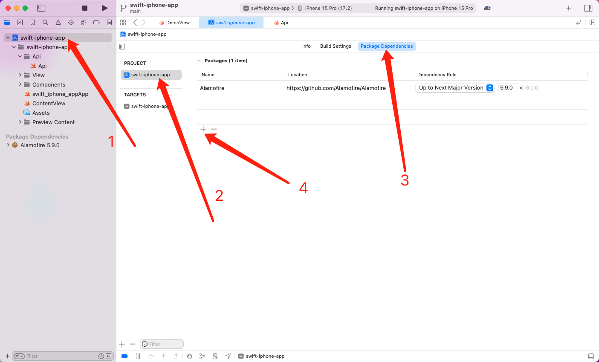
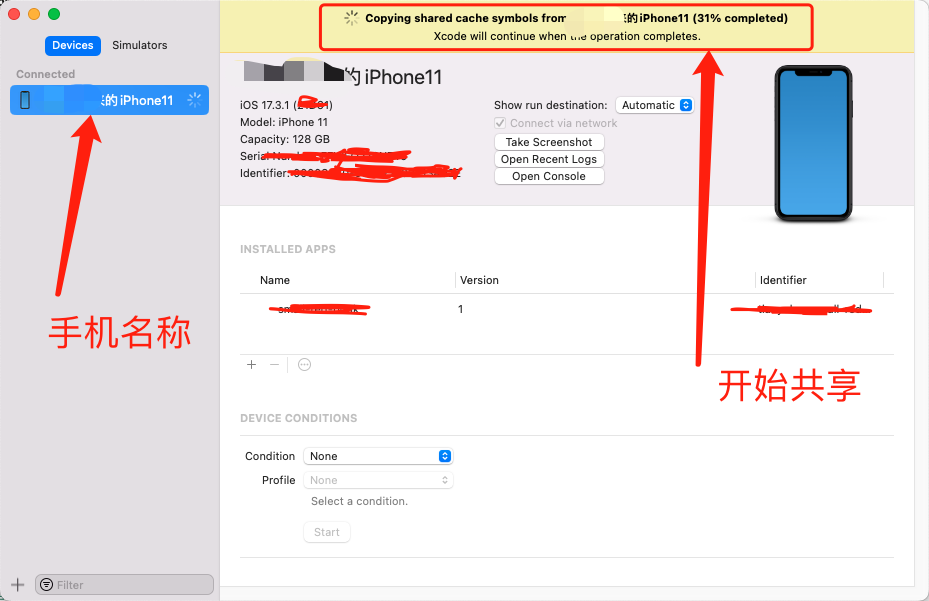
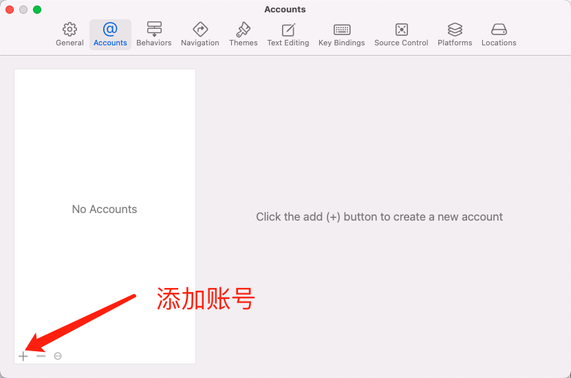
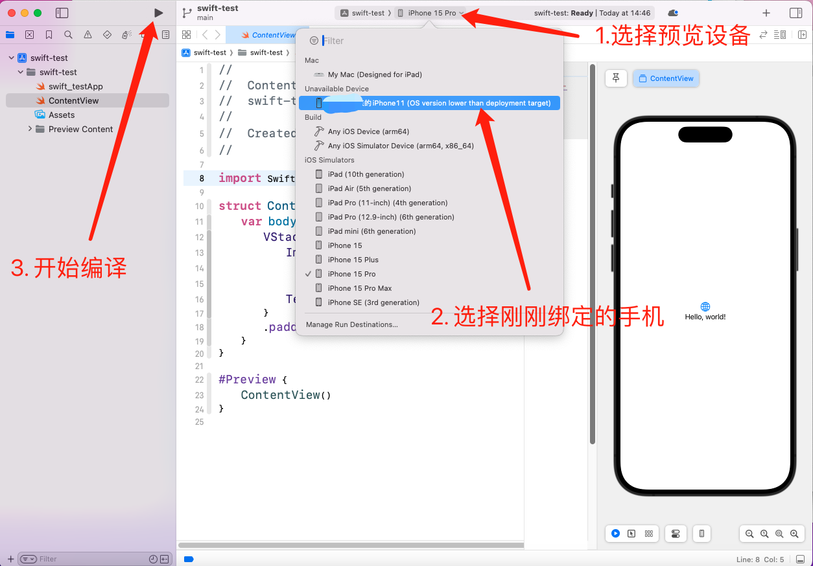
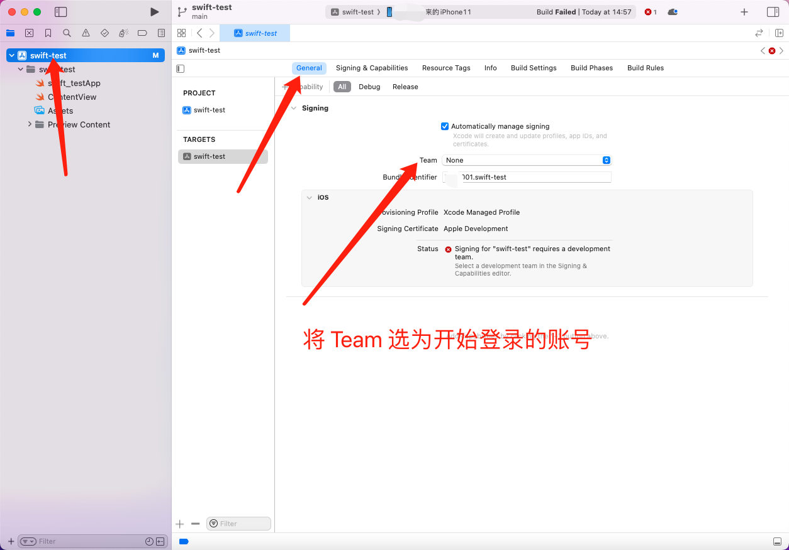
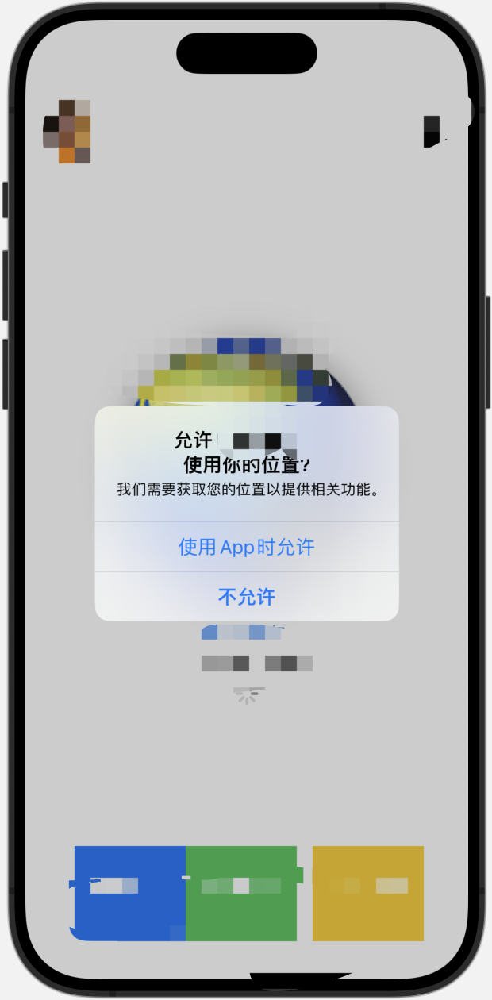

# 实战

## 安装依赖

在 Xcode 项目中的 `Package Dependencies` 可添加依赖项目



点击添加之后输入项目的 Git 仓库地址即可实现安装依赖

## 网络请求库

下载 [Alamofire](https://github.com/Alamofire/Alamofire)，这是一个在 swift 中的一个 http 请求库，类似前端使用的 [axios](https://github.com/axios/axios)。

安装之后可以导入：

```swift
import Alamofire
```

## 封装网络请求类

先定义了一个发送请求的 `Http` 类，里吗定义接口地址和请求

然后 `Index` 类里面是一个一个的接口请求方法，它需要继承 `Http`，通过回调的方式将响应结果传递给视图

```swift
class Http {
    private let baseURL = "https://api.thecatapi.com/v1"

    /// 发起网络请求
    /// - Parameters:
    ///   - url: 请求路径
    ///   - method: 请求方法，GET、POST等
    ///   - parameters: 请求参数
    ///   - completion: 请求完成后的回调闭包，包含一个 AFDataResponse<Data> 类型的参数
    func request(url: String, method: HTTPMethod, parameters: [String: Any]?, completion: @escaping (AFDataResponse<Data>) -> Void) {
        AF.request(baseURL + url, method: method, parameters: parameters)
            .responseData { response in
                completion(response)
            }
    }
}

class Index: Http {
    func getCatList(data: [String: Any], completion: @escaping ([CatImage]) -> Void) {
        request(url: "/images/search", method: .get, parameters: data) { response in
            switch response.result {
            case .success(let data):
                do {
                    let catImages = try JSONDecoder().decode([CatImage].self, from: data)
                    completion(catImages)
                } catch {
                    print("Error decoding cat images: \(error)")
                    completion([])
                }
            case .failure(let error):
                print("Error fetching cat images: \(error)")
                completion([])
            }
        }
    }
}
```

在试图中调用方法展示返回数据：

```swift
import SwiftUI

struct CatImage: Identifiable, Decodable {
    let id: String
    let url: URL
    let width: Int
    let height: Int
}

struct DemoView: View {
    @State private var catImages: [CatImage] = []
    let API = Index()

    var body: some View {
        List(catImages) { catImage in
            VStack(alignment: .leading) {
                Text("ID: \(catImage.id)")
                    .aspectRatio(contentMode: .fit)
                Text("Width: \(catImage.width), Height: \(catImage.height)")
            }
        }
        .onAppear {
            API.getCatList(data: ["limit": 10, "page": 1]) { images in
                catImages = images
            }
        }
    }
}

#Preview {
    DemoView()
}
```

这样就实现了一个 `GET` 请求展示了列表内容

## 添加请求头

`AF.request` 方法接收一个 `headers` 的参数字典，可以讲 token 等信息携带在其中

```swift
/// 发起网络请求
/// - Parameters:
///   - url: 请求路径
///   - method: 请求方法，GET、POST等
///   - parameters: 请求参数
///   - completion: 请求完成后的回调闭包，包含一个 AFDataResponse<Data> 类型的参数
func request(url: String, method: HTTPMethod, parameters: [String: Any]?, completion: @escaping (AFDataResponse<Data>) -> Void) {
    var headers: HTTPHeaders = [:] // 初始化一个空的 HTTPHeaders 字典

    headers["token"] = "xxxxx.xxxxxx.xxxxx"

    AF.request(baseURL + url, method: method, parameters: parameters, headers: headers)
        .responseData { response in
            completion(response)
        }
}
```

## 设置缓存

swift 中一般使用 [UserDefaults](https://developer.apple.com/documentation/foundation/userdefaults/)

```swift
import Foundation

/// 用户身份信息缓存
class UserCache {
    static let shared = UserCache() // 创建单例模式

    private let USER_INFO = "USER_INFO"
    private let userDefaults = UserDefaults.standard

    /// 存储信息
    func saveInfo(info: EmailLoginEmailData) {
        do {
            let codeData = try JSONEncoder().encode(info)
            userDefaults.set(codeData, forKey: USER_INFO)
        } catch {
            print("格式转换错误")
        }
    }

    /// 获取信息
    func getInfo() -> EmailLoginEmailData? {
        if let data = userDefaults.data(forKey: USER_INFO),
           let userData = try? JSONDecoder().decode(EmailLoginEmailData.self, from: data)
        {
            return userData
        }

        return nil
    }

    /// 删除信息
    func deleteInfo() {
        userDefaults.removeObject(forKey: USER_INFO)
    }
}
```

获取缓存信息：

```swift
let userInfo = UserCache.shared.getInfo()
```

## 页面跳转

现在需要跳转到首页 `NavigationLink` 方法的 `destination` 参数是跳转的目标，回调中是显示的内容，可以实现点击跳转

```swift
NavigationLink(destination: HomeView()) {
    Text("首页")
}
```

## 生命周期

- [onAppear](<https://developer.apple.com/documentation/swiftui/view/onappear(perform:)/>) 在视图出现时候执行的方法
- [onDisappear](<https://developer.apple.com/documentation/swiftui/view/ondisappear(perform:)/>) 当视图隐藏时候执行的方法

## 渲染地图

参考文档 [creating-and-combining-views](https://developer.apple.com/tutorials/swiftui/creating-and-combining-views)

```swift
// 1. 引入 MapKit
import MapKit
import SwiftUI

struct MapView: View {
    var body: some View {
        // 3. 使用 Map 为采用您使用该区域初始化的相机位置的视图
        Map(initialPosition: .region(region))
    }

    // 2. 创建一个私有计算变量来保存地图的区域信息
    private var region: MKCoordinateRegion {
        MKCoordinateRegion(
            center: CLLocationCoordinate2D(latitude: 30, longitude: 120),
            span: MKCoordinateSpan(latitudeDelta: 0.2, longitudeDelta: 0.2)
        )
    }
}

#Preview {
    MapView()
}
```

## 真机调试

1. 首先需要手机和电脑进行连接，需要使用数据线进行连接

数据线连接之后，通过顶部菜单栏进入 `window > Devices and Simulators`

这时候手机会提示是否信任该设备：


点击信任，并输入手机密码确认。确认之后 xcode 会显示手机的名字和正在共享缓存数据中：



2. 登录 Apple 账号

通过顶部菜单栏进入 `Xcode > Setting`，在 `Accounts` 中点击 `+` 添加 Apple 账号，选择和手机一样的账号登录。



3. 选择编译设备

通过顶部菜单选择刚刚添加的设备进行编译



4. 版本兼容和团队

这时候 Xcode 提示版本不兼容无法运行，所以需要在 Xcode 中将项目版本和手机版本改为一致：


更改团队：



5. 重新编译

接下来尝试重新编译，就会进入编译阶段，手机上会自动安装测试 App，可以直接运行


## JSON 处理

首先需要将返回的字符串转换为 `utf8` 格式，需要使用字符串的 [data](<https://developer.apple.com/documentation/swift/string/init(data:encoding:)>) 方法：

```swift
import Foundation

var jsonData = """
[{"id":"ala","url":"https://cdn2.thecatapi.com/images/ala.gif","width":333,"height":200}]
"""

if let data = jsonData.data(using: .utf8) {
    print("转换成功", data)
} else {
    print("格式转换失败啦")
}
```

后面需要使用 Swift 的 [JSONDecoder](https://developer.apple.com/documentation/foundation/jsondecoder/) 来将 JSON 数据转换为实例对象。

完整代码：

先创建一个 json 编译器，在使用 `decode` 方法，传入解析的类型和需要解析的数据，再使用 `do` 来补货解析错误的问题。

定义的方法必须的遵循 `Decodable` 协议。

```swift
import Foundation

var json = """
[{"id":"ala","url":"https://cdn2.thecatapi.com/images/ala.gif","width":333,"height":200}]
"""

let decoder = JSONDecoder()

struct CatImage:  Decodable {
    let id: String
    let url: String
    let width: Int
    let height: Int
}

if let jsonData = json.data(using: .utf8) {
    do {
        let data = try decoder.decode([CatImage].self, from: jsonData)

        print("格式转换成功的数据", data)
    } catch {
        print("JSON 格式转换错误")
    }
}else {
    print("格式转换失败啦")
}
```

封装成为通用方法：

```swift
import Foundation

var json = """
[{"id":"ala","url":"https://cdn2.thecatapi.com/images/ala.gif","width":333,"height":200}]
"""

let decoder = JSONDecoder()

struct CatImage: Decodable {
    let id: String
    let url: String
    let width: Int
    let height: Int
}

func jsonToObject <T: Decodable>(type: T.Type, json: String) -> T? {
    if let jsonData = json.data(using: .utf8) {
        do {
            let data = try decoder.decode(T.self, from: jsonData)

            print("格式转换成功的数据", data)

            return data
        } catch {
            print("JSON 格式转换错误")
            return nil
        }
    } else {
        print("格式转换失败啦")
        return nil
    }
}

let res = jsonToObject(type: [CatImage].self, json: json)

if let result = res {
    print("成功的处理", result)
} else {
    print("失败的处理")
}
```

## 获取经纬度

资料参考来源 [教程：将核心位置连接到 SwiftUI 应用程序](https://coledennis.medium.com/tutorial-connecting-core-location-to-a-swiftui-app-dc62563bd1de)

核心代码，`LocationDataManager.swift`：

```swift
import CoreLocation
import Foundation

/// 定位服务
class LocationDataManager: NSObject, ObservableObject, CLLocationManagerDelegate {
    var locationManager = CLLocationManager()
    @Published var authorizationStatus: CLAuthorizationStatus?

    override init() {
        super.init()
        locationManager.delegate = self
    }

    func locationManagerDidChangeAuthorization(_ manager: CLLocationManager) {
        switch manager.authorizationStatus {
        // 提供定位服务。
        case .authorizedWhenInUse:
            authorizationStatus = .authorizedWhenInUse
            locationManager.requestLocation()

        // 定位服务当前不可用。
        case .restricted:
            authorizationStatus = .restricted

        // 定位服务当前不可用。
        case .denied:
            authorizationStatus = .denied

        // 授权尚未确定。
        case .notDetermined:
            authorizationStatus = .notDetermined
            manager.requestWhenInUseAuthorization()

        default:
            break
        }
    }

    func locationManager(_ manager: CLLocationManager, didUpdateLocations locations: [CLLocation]) {
        // 插入代码以处理位置更新
    }

    func locationManager(_ manager: CLLocationManager, didFailWithError error: Error) {
        print("获取位置信息错误: \(error.localizedDescription)")
    }
}
```

视图中获取位置信息：

```swift
import CoreLocation
import SwiftUI

struct HomeView: View {
    @State private var locationManager = CLLocationManager()
    @State private var authorizationStatus: CLAuthorizationStatus = .notDetermined
    @StateObject private var locationDataManager = LocationDataManager()

    var body: some View {
        NavigationView {
            VStack {
                VStack {
                    switch locationDataManager.locationManager.authorizationStatus {
                    case .authorizedWhenInUse: Text("当前经纬度信息:")
                        Text("纬度: \(locationDataManager.locationManager.location?.coordinate.latitude.description ?? "Error loading")")
                        Text("经度: \(locationDataManager.locationManager.location?.coordinate.longitude.description ?? "Error loading")")

                    case .restricted, .denied:
                        Text("当前位置数据被限制或拒绝。")

                    case .notDetermined:
                        Text("正在获取位置信息...")
                        ProgressView()

                    default:
                        ProgressView()
                    }
                }
            }
        }
        .navigationBarBackButtonHidden(true)
        // 当视图出现时执行的方法
        .onAppear {
            self.requestLocationAuthorization() // 请求位置权限
        }
    }

    /// 请求位置权限
    public func requestLocationAuthorization() {
        locationManager.requestWhenInUseAuthorization()
    }
}

#Preview {
    HomeView()
}
```

另外还需要配置 `Info.plist` 用于在授权弹窗中的文案：

```
<key>NSLocationWhenInUseUsageDescription</key>
<string>需要使用您的位置信息</string>
<key>NSLocationAlwaysUsageDescription</key>
<string>需要在后台使用您的位置信息</string>
<key>NSLocationAlwaysAndWhenInUseUsageDescription</key>
<string>需要使用您的位置信息</string>
```


配置完整之后运行项目就会启动提示弹窗申请用户授权了：



## 安装和删除依赖包

[为你的 App 添加软件包依赖项](https://developer.apple.com/cn/documentation/xcode/adding_package_dependencies_to_your_app/)

## 申请网络请求

需要配置 `Info.plist` 用于在授权弹窗中的文案：

```
<key>NSNetworkAccessDescription</key>
<string>需要访问网络</string>
```

获取请求：

```swift
import Network
import SwiftUI

struct LaunchView: View {
    @State private var networkAuthorizationStatus: NWPath.Status = .requiresConnection

    var body: some View {
        NavigationStack {
            VStack {
              Text("hello")
            }
        }
        .toolbar(.hidden)
        .ignoresSafeArea(.all)
        .navigationBarHidden(true) // 隐藏导航栏
        .onAppear {
            // 请求网络权限
            let monitor = NWPathMonitor()
            monitor.pathUpdateHandler = { path in
                DispatchQueue.main.async {
                    self.networkAuthorizationStatus = path.status
                }
            }
            let queue = DispatchQueue(label: "NetworkMonitor")
            monitor.start(queue: queue)
        }
    }
}

#Preview {
    LaunchView()
}
```

## 启动页面

设置 App 的启动页面一般有两种方式：

**Launch Screen.storyboard**

在项目根目录新建文件，选择 `Launch Screen`，文件名就可以叫 `Launch Screen`


进入 `Launch Screen.storyboard` 可以在试图中点击右上家的加号添加一些组件，实现布局样式。

最后在 app 的信息设置中选择刚才编辑好的文件即可。


**单独的 View**

上面的做法可能扩展性不是很强，你也可以使用一个单独的 view 来实现启动页面

可以使用一个变量控制是否在启动页面还是主页面

```swift
ZStack {
    if navigateRunView == true {
        LayoutView() // 主页面
    } else {
        LaunchView() // 启动页面
    }
}
```

## 隐私协议
